# Harness Manager user guide

This guide is for lab users of Harness Manager (HM) on an Arm MPS3 (V2M-MPS3): a board
on your desk, or a shared lab board behind a hub. It is organised by what you want to do.
Each task says when you would do it, where it is in the app, the command, and what can go
wrong.

Harness Manager version 0.1.0, as on `main`. Every command here is checked against
`harness-manager <verb> --help` on `main`.

**Marks.** A task that needs more than this PC says so on a **Needs** line:

| Mark | Meaning |
|---|---|
| a board | a powered MPS3 running the SoC Labs harness |
| the Linux harness | the board runs the Linux harness (MicroBlaze V Linux), not bare metal |
| a hub | the board sits behind a lab hub (fpgahub) |
| the Debug USB | the MPS3 Debug USB cable is plugged into this PC |
| signed releases | SoC Labs has published signed releases. **Not live yet:** no release key exists, so every client refuses every channel ([KEYS.md](KEYS.md)) |

Contents:
1. [Install](#1-install)
2. [First run](#2-first-run)
3. [Add a board](#3-add-a-board)
4. [Leases: share a lab board](#4-leases-share-a-lab-board)
5. [Consoles](#5-consoles)
6. [Program a design](#6-program-a-design)
7. [Build your own DUT](#7-build-your-own-dut)
8. [Debug: OpenOCD and XVC](#8-debug-openocd-and-xvc)
9. [The front panel](#9-the-front-panel)
10. [Updates: the harness and the app](#10-updates-the-harness-and-the-app)
11. [Settings](#11-settings)
12. [The Linux harness](#12-the-linux-harness)
13. [Checks: the HIL runbooks, unattended](#13-checks-the-hil-runbooks-unattended)
14. [Troubleshooting](#14-troubleshooting)

Appendices: [A. Command reference](#a-command-reference),
[B. Where things are](#b-where-things-are), [C. More documents](#c-more-documents).

---

## 1. Install

**When:** once per PC, and again to upgrade.

You need git, and Python 3.10 or newer (or [uv](https://docs.astral.sh/uv/)). The
repository is private: ask SoC Labs for access and add an SSH key to your GitHub account.

Linux and macOS:

```bash
git clone git@github.com:SoC-Labs/HarnessManager.git
HarnessManager/scripts/install.sh --with-serial
```

Windows (PowerShell):

```powershell
git clone git@github.com:SoC-Labs/HarnessManager.git
powershell -ExecutionPolicy Bypass -File HarnessManager\scripts\install.ps1 -WithSerial
```

It takes about 20 seconds (about 5 with uv). Nothing needs root or Administrator.

| Installer option | Take it when |
|---|---|
| `--with-serial` / `-WithSerial` | you own an MPS3: the Debug USB serial ports need pyserial |
| `--with-app` / `-WithApp` | you want a native window on Windows or macOS (Linux uses a Chrome or Chromium app window) |
| `--offline DIR` | the PC has no network: install from a wheelhouse |
| `--no-desktop` | you want no application-menu entry (Linux) |
| `--uninstall` / `-Uninstall` | you want it gone; your settings and SD backups stay |

Check it: `harness-manager version` prints `0.1.0`.

**Linux only:** to use the Debug USB, your user needs the serial ports:
`sudo usermod -aG dialout $USER`, then log out and back in.

**Upgrade:** `git pull`, then run the installer again. It keeps your settings and options.
Once signed releases exist, the app can also update itself ([section 10](#10-updates-the-harness-and-the-app)).

**What can go wrong**
- `harness-manager: command not found`: `~/.local/bin` is not on your PATH. The installer
  printed the line for your shell and the full path to use until then. bash: add it to
  `~/.bashrc` **and** to `~/.bash_profile` (or `~/.profile`, whichever exists), because a
  login shell (ssh, `bash -l`) never reads `~/.bashrc`. tcsh/csh:
  `set path = ( $HOME/.local/bin $path )` in `~/.cshrc`. Every shell:
  [INSTALL.md](INSTALL.md#when-harness-manager-is-not-on-path). On Windows, open a new
  terminal.
- The installer stops: it says why (Python too old, no `python3-venv`, no network, a
  proxy). Running it again is always safe.

[INSTALL.md](INSTALL.md) has every option, each Linux distribution's prerequisites,
proxies, the wheelhouse, and the install root.

## 2. First run

**When:** right after installing, or to look around with no hardware.

```bash
harness-manager app --demo
```

This opens the app with scripted demo boards. Nothing touches hardware. Close the window
when you are done; `harness-manager daemon stop --demo` stops the demo service. On Linux,
the application menu has **Harness Manager** and **Open with Demo Boards**.

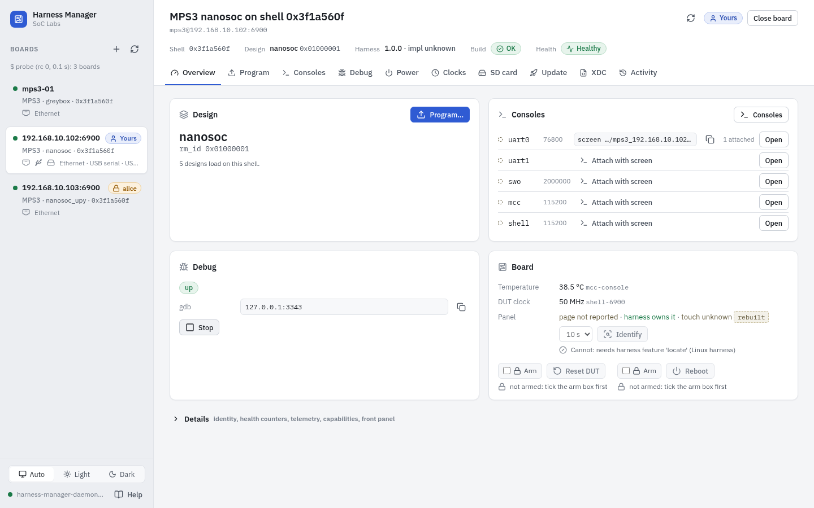

**The layout.**
- **The rail** (left) lists boards. **+** adds one by address; the circular arrow scans.
  At the bottom: the theme, the service line, **Settings** (the sliders icon) and **Help**.
  [The sidebar](#the-sidebar-order-favourites-and-your-boardstoml-boards) below has the details.
- **The header** shows the selected board: shell, design, harness, build check, health,
  and for a hub board the tunnel and the lease. **Harness** says which version it shows:
  **release 1.1.0** (the signed catalogue's release the board runs, once **Update > Harness
  versions** has read its list), with **firmware 1.0.0** beside it when the firmware's own
  number differs; before that list is read, **firmware 1.0.0** (what the harness firmware
  reports). The circular arrow reads the board again: its info, the **Card** line and the SD
  journal (an interrupted SD install).
- **The sections:** Overview, XDC, Build, Program, Consoles, Debug, Power, Clocks, SD card,
  Update, Checks, Activity. In a narrow window the tabs wrap onto a second row.
- **Overview** has four tiles: Design, Consoles, Debug and Board. A "Needs attention" strip
  appears only when something is wrong. **Details** (folded) holds identity, health counters,
  telemetry, capabilities and the front panel.

### The sidebar: order, favourites and your boards.toml boards

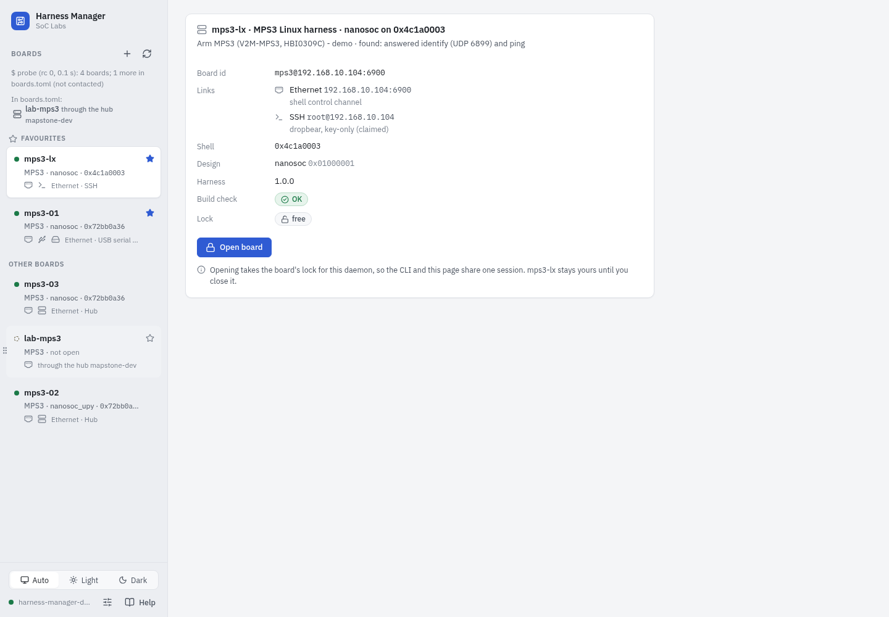

| To | Do |
|---|---|
| reorder the boards | drag a card (touch: drag its grip, the dots at its left edge). A line shows where it lands. A click without a drag still opens the board. |
| reorder with the keyboard | focus a card (Tab), then **Alt+Up** or **Alt+Down**. A screen reader hears the new position. |
| pin a board at the top | click its star (or Tab to the star, then Space). It moves to **Favourites**. Click again to put it back where it was. |

- **Your order and favourites follow you, not the browser.** They are settings
  (`general.board_order` and `general.favourite_boards`, lists of board ids), so every window
  and the app share them. `harness-manager config get general.board_order` prints the order.
  The demo (`app --demo`) keeps its own.
- **Boards in `boards.toml` are always listed**, also straight after the service restarts. One
  that is not open shows **not open** and its route (`through the hub mapstone-dev`).
  Nothing contacts it until you click it and press **Open board**; then it goes through its own
  `via` and hub.
- **Scan** (the circular arrow) looks on this network, and also lists your `boards.toml`
  boards under the status line: a board behind a hub never answers a scan.
- **+ (Add by address)** uses the matching `boards.toml` entry: type `192.168.10.101` and the
  second field fills with that entry's route (`hub`), with a line naming the entry. Type another
  route to override it.

**The app and the command share one session.** A per-user background service
(harness-manager-daemon) owns the boards. `harness-manager app` and every command talk to
it, so you can use both at once. `harness-manager daemon status` shows it.

| Command | Use |
|---|---|
| `harness-manager app` | the app in its own window |
| `harness-manager ui` | the same page in a browser tab |
| `harness-manager ui --no-browser` | print the URL only (for `ssh -L`) |
| `harness-manager daemon status` | is the service running, and where; the tool variables it started with (shown while it runs) |
| `harness-manager daemon stop` | stop it; the next command starts it again |
| `harness-manager help --tabs` | the help text the app's **Help** shows |

Add `--json` to any verb for one JSON object on stdout, or `--tsv` for tab-separated rows.

**What a board can do: the capability view.** Harness Manager never guesses. It asks the
board and lists each capability as available or not, and a missing one says what it needs.

```bash
harness-manager info 192.168.10.101
```

```text
control    idle
can        clock_dut, console_dut, debug_dut, deploy_partial, health, identify, reset_dut
cannot     console_controller: needs the Debug USB cable
cannot     reboot_board: needs the Debug USB cable, a networked power plug, or harness firmware with 'mccif' or 'mcc_local' (net-protocol v0.18)
cannot     power_cycle: needs a networked power plug in boards.toml (Shelly, Tasmota or NETIO)
```

The app shows the same list under **Details > Capabilities**, and greys out a button whose
capability is missing, with the reason beside it.

**What can go wrong**
- **The window is blank** (ThinLinc and other remote desktops): the app window now starts
  without the desktop's D-Bus session bus, which caused it. If something else needs that
  bus, set `HARNESS_MANAGER_APP_KEEP_DBUS=1`. `harness-manager ui` opens a browser tab
  instead.
- **No display** (an SSH session): `app` and `ui` print the URL and the `ssh -L` command
  that forwards it. Run that on your own machine, then open the URL there.
- **"Session expired" banner:** the service restarted or the page came from an old link.
  Run `harness-manager ui` again.

## 3. Add a board

There are two ways to reach a board. Pick the one that matches where it is.

| Where the board is | How HM reaches it | Go to |
|---|---|---|
| on your desk, plugged into this PC | Ethernet to `192.168.10.101`; the Debug USB once, for the first install | [3.1](#31-a-board-on-your-desk) |
| in the lab, behind a hub | the hub (fpgahub) over SSH or its REST API, with a lease | [3.2](#32-a-lab-board-behind-a-hub) |

**Board names.** The app and `info` call a board by its name when it has one, else by its
address. A hub board takes its name from the hub (`mps3-01`). Name your own in
`~/.config/harness-manager/boards.toml`; your name always wins. It is a label only: you
still address the board by its address.

```toml
[boards."mps3@192.168.10.101:6900"]
name = "my-mps3"
```

### 3.1 A board on your desk

**Needs:** a board; the Debug USB for the first install.

**In the app:** click **+** in the rail, type `192.168.10.101`, and click **Add**. Select
the board, then **Open board**. Opening takes the board's lock for this service; **Close
board** gives it back.

**First install (once, about 15 minutes).** A new board needs the SoC Labs harness on its
configuration SD. Do these steps in order. Step 2, the backup, is your way back.

**In the app:** click **+** in the rail, then **Over USB (a new board plugged into this PC)**,
**Scan**, and **Add and bring up**. The **Bring up this board** dialog walks the same steps
as the commands below: the source (a bundle folder or zip, or a signed release once signing
keys exist), the backup, the write, the reboot through the MCC, and waiting for the harness
on Ethernet. Its **Write the configuration SD** step can also write the card in this PC's own
card reader instead of over the Debug USB (off by default: Settings → Bring-up,
`bringup.sd_flash`; on the command line, `harness-manager flash devices|write`). For a Linux
harness on a blank user microSD, it writes a whole-card image in the card reader. The same
plan runs from the command line as `harness-manager bringup - --serial PORT --volume PATH
--bundle DIR`.

**On the command line:**

1. **Connect and look.** Plug in the Debug USB and Ethernet, and power the board on. The
   configuration SD appears as a drive named `V2M-MPS3`.

   ```bash
   harness-manager probe
   ```

   It lists the board with its USB links. The Debug USB adds four serial ports; `probe`
   says which one is the MCC (the board controller).

   | | Serial port (the MCC) | SD drive |
   |---|---|---|
   | Linux | `/dev/ttyUSB0` | `/media/$USER/V2M-MPS3` |
   | macOS | `/dev/cu.usbserial-…` | `/Volumes/V2M-MPS3` |
   | Windows | `COM7` | `E:\` |

   In the commands below, `-` means "this board, over USB only".

2. **Back up the SD.** It writes one zip and prints its sha256. Keep it off the board.

   ```bash
   harness-manager sd - --volume /media/$USER/V2M-MPS3 backup ~/mps3-backups
   ```

3. **Install the harness bundle** (a directory from SoC Labs):

   ```bash
   harness-manager sd - --volume /media/$USER/V2M-MPS3 install ~/harness-bundle \
       --backup ~/mps3-backups/<the zip from step 2>
   ```

   It asks first. It refuses without a backup and never writes the MCC's own firmware
   (`.ebf` files). A USB write can take 5 minutes. A slow write is not a failed one: **do
   not unplug, power off, or start a second write.**

4. **Reboot the board** so it loads the new harness. It asks first, then waits until the
   board has gone down and come back.

   ```bash
   harness-manager mcc - --serial /dev/ttyUSB0 reboot
   ```

5. **Check it over Ethernet.** Give this PC's Ethernet port an address on the board's
   network (`192.168.10.1`, netmask `255.255.255.0`), then:

   ```bash
   harness-manager info 192.168.10.101
   ```

   The board shows its harness version and `control idle`. Unplug the Debug USB: daily
   work needs only Ethernet.

The app's **SD card** section runs the same four steps (Back up the SD, Install files,
Reboot and witness it, Restore the backup).

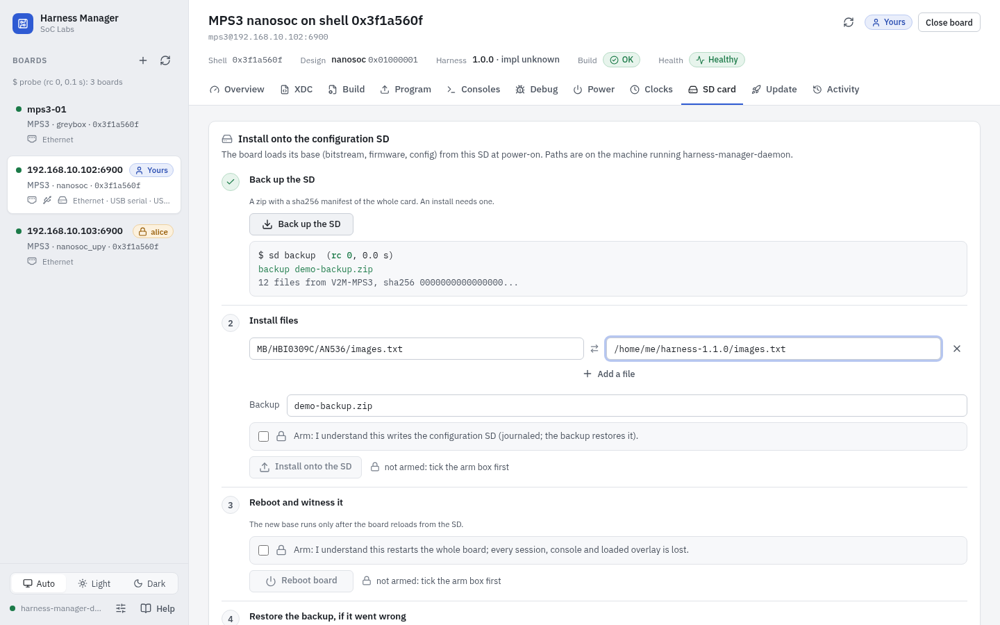

**A networked power plug** lets HM power-cycle the board. Add it to `boards.toml`:

```toml
[boards."mps3@192.168.10.101:6900".power]
kind = "shelly_gen2"
url = "http://192.168.10.50"
```

Then `harness-manager power show 192.168.10.101` reads it, and
`harness-manager power cycle 192.168.10.101` cycles it. On Windows, write paths in
`boards.toml` with forward slashes, or in single quotes: TOML reads a backslash inside
double quotes as an escape and refuses the file.

**What can go wrong**
- `offline`: check the power, the cable and your PC's address (step 5).
- An interrupted install leaves a marker, and the next install refuses until you restore
  the backup: `harness-manager sd - --volume DRIVE restore <zip>`. The app shows a red
  "Interrupted SD install" banner with **Go to recovery**.
- More in [section 14](#14-troubleshooting).

### 3.2 A lab board behind a hub

**Needs:** a hub, and either an SSH account on the hub or an fpgahub token.

A hub is a named setting. You add it once, then add boards that use it. **No hub is the
default:** a board on your desk needs none, and nothing hub-related runs until you add one.

**Step 1: add the hub.** Choose one.

| You have | Command |
|---|---|
| an SSH account on the hub (the lab today) | `harness-manager hub add lab --ssh mapstone-dev.ecs.soton.ac.uk` |
| an fpgahub token (no SSH) | `harness-manager hub add remote --url https://mapstone-dev.ecs.soton.ac.uk:7246 --ca-file ~/lab-hub-ca.pem --token-stdin` |

With `--token-stdin`, paste the token when asked. It goes into the secret store (the OS
keyring, else a private file), never into a settings file. Use port 7246, not 7245 (7245
needs a client certificate). Useful extras: `--jump HOST` (an SSH jump host),
`--lease-ttl 30m`.

**Step 2: test the connection.** It never takes a lease.

```bash
harness-manager hub test lab
```

It checks, in order, **config, reach, auth, group, targets, target**, and stops at the first
failure with the reason and the next step. For example, a login where `sg fpga` does not
work stops at **group** and prints the admin's `usermod -aG fpga` command. The group step
checks what Harness Manager really uses, `sg fpga -c true`: when `sg` works but `id -Gn`
does not list `fpga` (a stale group cache on the hub), the step passes with a note.
`harness-manager config test hubs lab` runs the same test.

**Step 3: add the board.** List what the hub offers, then add one:

```bash
harness-manager hub targets lab
harness-manager hub targets lab --add mps3_01_pl
```

`--add` writes the board into `boards.toml`: `hub.use`, the target, `via = "hub"`, its
address and its name. It adds no MCC share: Harness Manager reaches the board controller ON the
hub (pyverify's tools over ssh) and never starts a share on `tty_00`. Then open it in the app, or run
`harness-manager info 192.168.10.101`.

| Hub command | What it does |
|---|---|
| `hub list` | the hubs, and boards that still have an inline hub table |
| `hub add NAME --ssh HOST` or `--url URL` | add a hub (`--update` changes an existing one) |
| `hub token NAME --stdin` / `--ref file:PATH` / `--clear` | set, point at, or forget your token |
| `hub test NAME [--target T]` | test the connection; never takes a lease |
| `hub targets NAME [--add TARGET]` | what the hub offers; `--add` writes a board for one |
| `hub adopt BOARD [--as NAME]` | "Make this a hub": turn a board's inline hub table into a named hub |
| `hub remove NAME [--force]` | remove a hub and your stored token for it |

**In the app:** once the board is in `boards.toml`, it is listed in the rail as **not open**;
select it and press **Open board**. **+** in the rail has a second field, "through a hub".
For an address a `boards.toml` entry names, it fills with that entry's route (`hub`) by
itself. For any other address, type an SSH host: that adds a board through an SSH hub for
this session.

**Settings → Hubs** does what the `hub` commands do: **Add a hub** (SSH or REST, with **Test
before adding**), **Test connection** step by step (config, reach, auth, group, targets; no
lease is taken) with the fix for the step that failed, **Add this board** from what the hub
offers, **Make this a hub** for a hub written inline in `boards.toml`, and **Remove**. The
group step runs `sg fpga -c true`, the way HM uses the group. When `id -Gn` on the hub leaves
`fpga` out (a stale group cache) but `sg` works, the step passes with a note.

A board added with **+** and an ssh host, or with `--via ssh:HOST` on one command, gets the
tunnel only. Leases need a hub table in `boards.toml`, which `hub targets --add` writes.

**Your administrator** may define machine hubs for everyone in the policy file
([section 11](#11-settings)). You still set your own token: `harness-manager hub token lab --stdin`.

**What can go wrong**
- `hub test` stops at **auth**: your SSH key is not accepted, or the host key changed.
- It stops at **group**: your account is not in the `fpga` group. Ask the hub admin.
- A REST token gets 401: the hub did not accept it. The message names where the token came
  from.
- **With a REST token only**, force-release needs an admin token, and lease requests carry
  no message and no "keep for N minutes". The data plane (consoles, programming) still
  needs a route to the board, which the lab hub does not offer today, so an SSH account is
  still needed. [HUB_MODE.md](HUB_MODE.md) explains both.

## 4. Leases: share a lab board

**Needs:** a hub.

**When:** before you change anything on a lab board. A lease is how the hub keeps two
people off one board, and a lease that lapses lets the hub reset the board under you.

Reading the board works without one. HM refuses these without the lease: XVC, the SSH
claim, slot and card changes, and harness installs. Programming, reset and debug are not
refused, but the lab rule is the same: the Overview's "Needs attention" says "This client
must not drive the board until the lease is yours" when someone else holds it.

**In the app:** each open board behind a hub has a lease badge in the board list, and the
header's **Hub** line shows the tunnel and the lease. The Overview's Board tile repeats the
badge on its **Hub lease** line.

**Which name the lease uses.** The hub knows the board by two names: the physical board
(`mps3_03`) and the target it is leased as (`mps3_03_pl`). Both names are current, and
neither is deprecated. HM's lease text uses the board name and shows the target as a
detail: "mps3_03 on mapstone-dev (target mps3_03_pl)". HM takes the lease on the target,
the same name the platform's scripts (pyverify) use, so everyone shares one lease and one
queue. If the hub gives the target no board of its own, the text uses the target alone.
[docs/HUB_MODE.md](HUB_MODE.md#boards-and-targets-the-name-hm-shows-the-name-it-leases-on)
explains why.

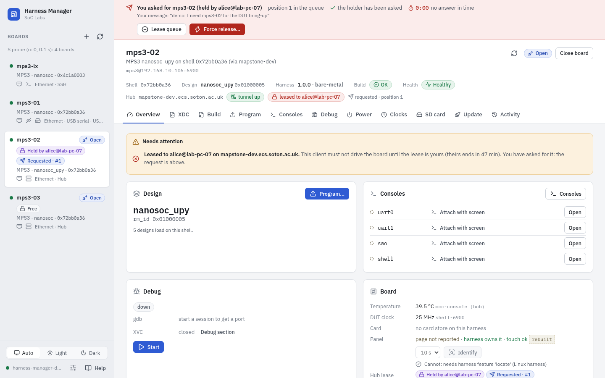

| The board list says | The header's lease chip | It means | You can |
|---|---|---|---|
| **Yours** | lease yours · 27 min | this Harness Manager holds the lease | **Release lease** (asks first). The service renews it while the board is open here |
| **Free** | no lease | nobody holds it | **Acquire lease** (it may queue; **Cancel** leaves the queue) |
| **Held by alice@lab-pc-07** | leased to alice@lab-pc-07 | someone else holds it | **Request board** |
| **Held by david@mapstone-dev (another session)** | leased to david@mapstone-dev (another session) | your hub name holds it, but not this Harness Manager: another session, or a script you run (a soak, a runner) | nothing here: use the board there, or release it there |
| **Requested · #1** or **Queued** (beside Held by) | requested · position 1 | you are waiting for it | **Leave queue** (the bar above the header) |

"Yours" means this Harness Manager holds the lease's token, not just your name: every lab
session shares one hub principal (david@mapstone-dev), so a lease another session took is
named as such, and background checks on the board stay paused while it holds it. The
board lock's chip says **Open** (the board is open here); the lease is its own badge. A
board with no hub has no lease badge.

**Who may drive a hub board: the lease holder, here.** On a board behind a hub, the buttons
that drive it run only while this Harness Manager holds its lease: **Program**, **Restore
baseline**, **Reset DUT**, **Reboot**, **Restart shell**, **Power-cycle**, the DUT clock,
**Detect** and **Open session** (OpenOCD), and XVC **Open**. Otherwise each is off, not the
highlighted button, and says why in one line ("Program is for the lease holder only: alice
holds this board"; with nobody holding it, "acquire it first (header)"). A lease your hub
name holds in another session counts as someone else's here; the service's own gates (XVC,
harness installs) refuse it too. A board with no hub has no lease rule.

**Before you open a board,** its preview has two rows: **This app's lock** (Harness Manager's
own lock on the board: free unless another Harness Manager session or tool on this machine
has it open) and **Hub lease**: who held it when this service last read it, with the time
("held by alice@lab-pc-07, as of 10:42:07"). The service reads it again when you open the
board; a board it has not read since it started says so instead.

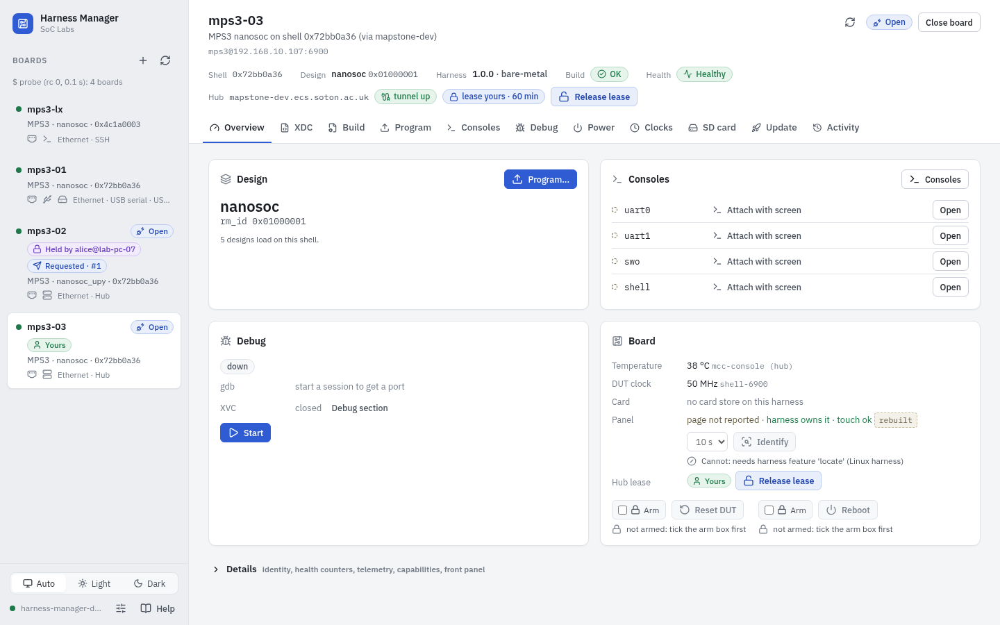

**Release lease** always asks first: "Release mps3_03? Others can take it; background
checks pause. The hub leases it as target mps3_03_pl." It names who is next in the queue,
and says why when a job on the board stops it (releasing mid-deploy hands a half-programmed board to the next person).
Force-release is separate, red, and only for someone else's lease ([Force-release](#force-release)).

**Closing a board you hold.** **Close board** on a board whose lease this Harness Manager
holds asks "Also release the lease on mps3_03?":

- **Release and close:** others can take the board now.
- **Keep the lease:** it stays yours until it expires, but nothing renews it while the
  board is closed. Open the board again to keep renewing it.
- **Cancel:** the board stays open.

Any other board (no hub, a free lease, someone else's) closes without asking. If the
release fails (the hub does not answer), the board stays open and the dialog says why.
Over the API, `DELETE /boards/{bid}?release=true` does both.

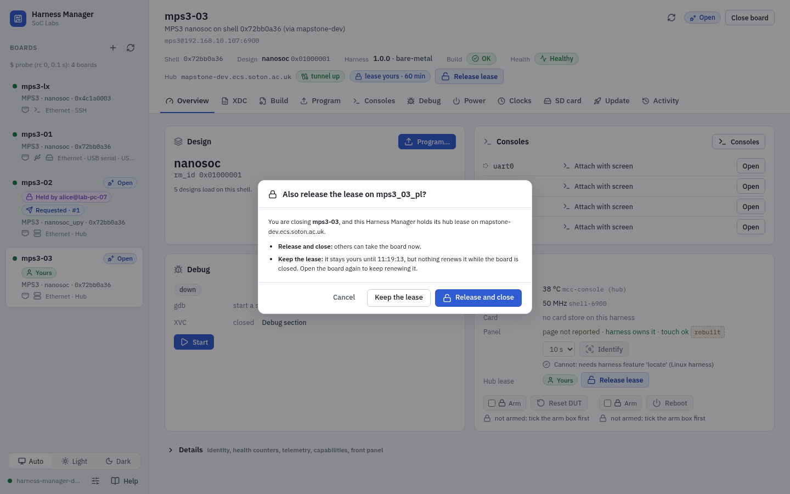

**On the command line.** `TARGET` is the board's address (`192.168.10.101`); its
`boards.toml` hub table names the hub. The output names the hub's board, with the target
it is leased as: `mps3-01 (mps3_01 on mapstone-dev, target mps3_01_pl): held by …`.
`--json` has both `board` and `target`, and the `lease` TSV ends with a BOARD column.

| Command | What it does |
|---|---|
| `lease show TARGET` | who holds it and until when, the queue, and the requests |
| `lease acquire TARGET [--ttl S]` | take it; waits in the queue if someone holds it |
| `lease release TARGET` | give it back (only a lease this Harness Manager took) |
| `lease request TARGET --message M` | ask the holder to give it up; waits, with a 2:00 countdown |
| `lease requests TARGET` | the requests waiting for your answer |
| `lease respond TARGET ID --release` or `--keep MINUTES` | answer a request (keep: 5, 15, 30 or 60) |
| `lease force TARGET` | force-release it after the 2:00 ran out (asks first) |
| `lease leave TARGET` | leave the queue and withdraw your request |
| `lease dismiss TARGET` | clear the "your lease was force-released" notice |

Default lease lengths: 1 hour for `acquire`, 2 hours once a request succeeds. A hub's
`lease_ttl`, `request_ttl` and `queue_timeout` change them.

### Ask for a board someone else holds

1. Click **Request board** (or run `harness-manager lease request 192.168.10.101 --message "need it for the 15:00 demo"`).
2. You join the queue, and the holder's Harness Manager shows your request.
3. A bar shows your queue position and a 2:00 countdown.
4. The holder answers **Release now** (the board is yours) or **Keep for N min** (you keep
   waiting; force becomes possible when their time runs out).
5. With no answer in 2:00, and you at the head of the queue, **Force release…** turns red.

**Leave queue** (or `lease leave TARGET`, or Ctrl-C on `lease request`) withdraws your
request at any time.

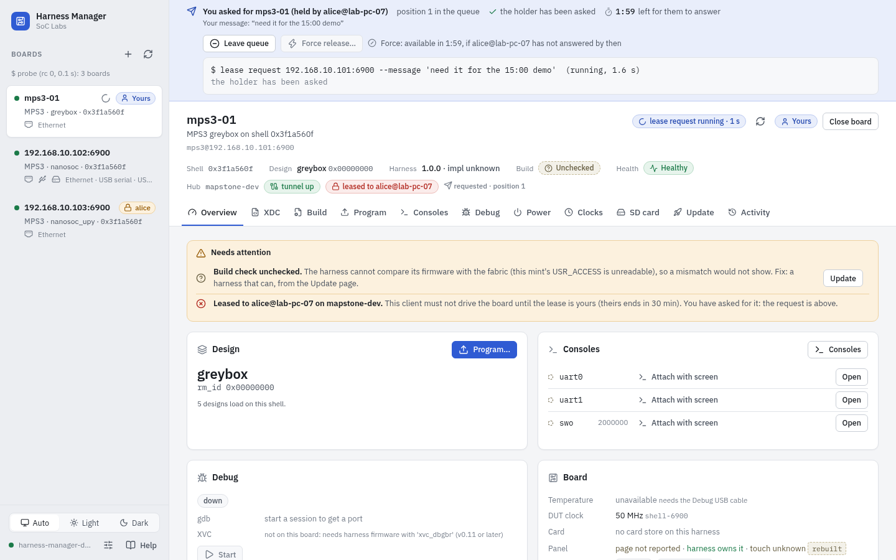

### Force-release

**Force release…** kicks the holder off the board now: anything they are running stops.
It asks first. When no Harness Manager session is known to hold the lease, the holder may
be a script (a soak or a runner). Then you must also **type the board's name**
(`mps3-01`) before **Force** is enabled. From a script, `--yes` is not enough there: pass
`--confirm-board mps3-01`.

```bash
harness-manager lease force 192.168.10.101
harness-manager lease force 192.168.10.101 --yes --confirm-board mps3-01   # no terminal
```

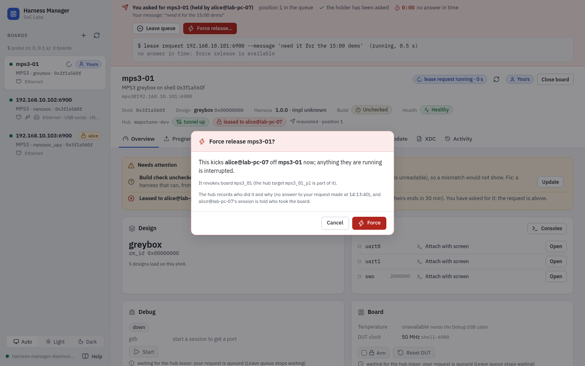

### When you hold it and someone asks

A banner shows on every page: "`<who>` wants mps3-01: *message*", with a countdown,
**Release now**, and **Keep for 5 / 15 / 30 / 60 min**. If someone at the board taps the
request on its front panel, the banner says so. A tap never releases the board.

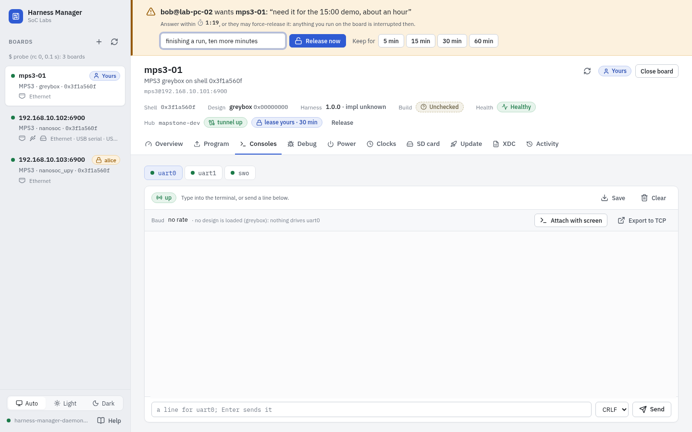

### When your lease was taken

A red banner says who force-released the board, when and why. Stop driving the board
until you have the lease again. **Dismiss** (or `lease dismiss TARGET`) clears it; the next
forced release shows again.

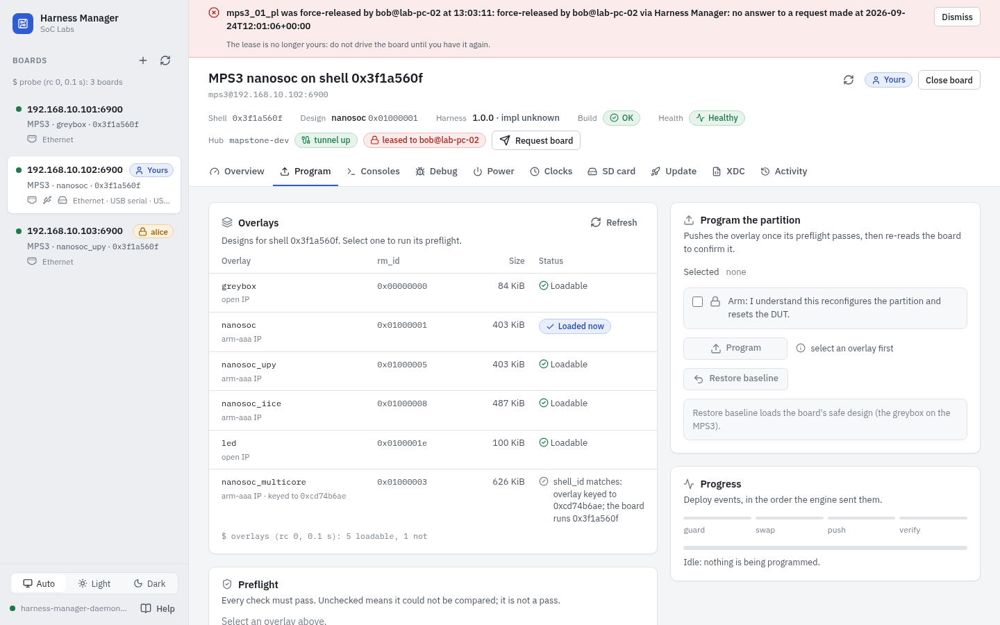

**What can go wrong**
- **Force stays grey:** it tells you why: the 2:00 has not run out, the holder answered
  "keep", you are not at the head of the queue, or (REST hubs) your token is not an admin
  token.
- **"you already hold this board (another session)":** the hub keys leases on
  `user@host`, so a second session of yours gets the board back instead of queueing.
- **The board passed to someone new while you waited:** your request is sent to them with
  a fresh 2:00, and force waits for that.

[LEASE_REQUESTS.md](LEASE_REQUESTS.md) has the full rules.

### HM on a shared board: what it does in the background

A lab board's control port (the MPS3's 6900) serves **one client at a time**. While any
program holds it, every other connection is turned away, and that can cost someone
else's run a control call. On 2026-09-27 a 24 h soak died 17 minutes in this way.
So Harness Manager contacts a board **on its own** (a presence hello, the Overview's
refresh, the panel and telemetry polls) only when all four of these hold:

1. **A window shows the board.** The app or a browser tab has it selected and on screen.
   Closing the tab, hiding the window or selecting another board stops it within
   seconds. A window that goes to sleep stops counting after 45 s.
2. **The lease is not someone else's.** While another person holds the board's hub lease,
   HM stops all background contact. The header shows **Paused: lease held by
   `<who>`**.
3. **You have not turned it off** (see below).
4. **The board did not just turn HM away.** If a background connection is refused,
   reset or times out, HM treats the board as busy with another client. It waits 30 s,
   then doubles the wait each time, up to 10 min. The header shows
   **Busy (another client)**, never an error. Any answer from the board ends the wait.

HM's own requests to one board take the port one at a time, in the order they were asked,
so they never turn each other away and never count as another client. The board lets go
of a closed connection a moment late, so a connection HM opens right after its own is
tried again for up to a second before it counts.

Anything you ask for yourself is not affected: a button, a CLI command, or a job you
started. It still goes straight to the board. When the lease is someone else's,
`info` (and the page's **Read now**) says who holds it.

**Consoles.** A console that is already connected when someone else takes the lease stays
connected until it drops. After that it does not reconnect: it shows **paused: lease held
by `<who>`** and reconnects by itself once the lease is yours or free. Opening a new
console on the board while someone else holds its lease is refused, and the message names
the holder. A board with no hub has no lease, so its consoles work as before.

**The MCC.** If background telemetry finds another program reading the board's MCC
console, HM treats that like a refused connection: it backs off and shows
**Busy (another client)**.

Each background call opens the control port, asks one thing and closes it at once. HM
never keeps a control connection open between polls.

**Turn background contact off.** HM then touches the board only when you ask:

| For | Setting |
|---|---|
| every board | `harness-manager config set general.background_poll off` (Settings: General) |
| one board | `poll = "off"` in its `boards.toml` table (`[boards.defaults]` for all) |
| back to the default | `general.background_poll on-view`, or `poll = "on-view"` for one board |

A board's `poll` overrides the general setting, both ways. The demo (`--demo`) has
scripted boards only and polls them as before.

## 5. Consoles

**Needs:** a board.

**When:** to see the DUT's UART output or type into it.

| Console | Link | Rate |
|---|---|---|
| `uart0`, `uart1` | Ethernet | fixed by the loaded design: 76800 on nanosoc |
| `swo` | Ethernet | 2000000 |
| `mcc` (board controller), `fpga_uart0` … | the Debug USB, or the hub's serial shares | changeable |

**In the app:** the Overview's **Consoles** tile, or the **Consoles** section. **Open**
shows the console in the page. **Attach with screen** gives the `screen` command to copy.
**Export to TCP instead** makes a local port for a raw TCP terminal. The send line under
the terminal sends a line with Enter; the select beside it picks the ending (CRLF, CR or
LF), starting at **Settings > Consoles > What Enter sends**.

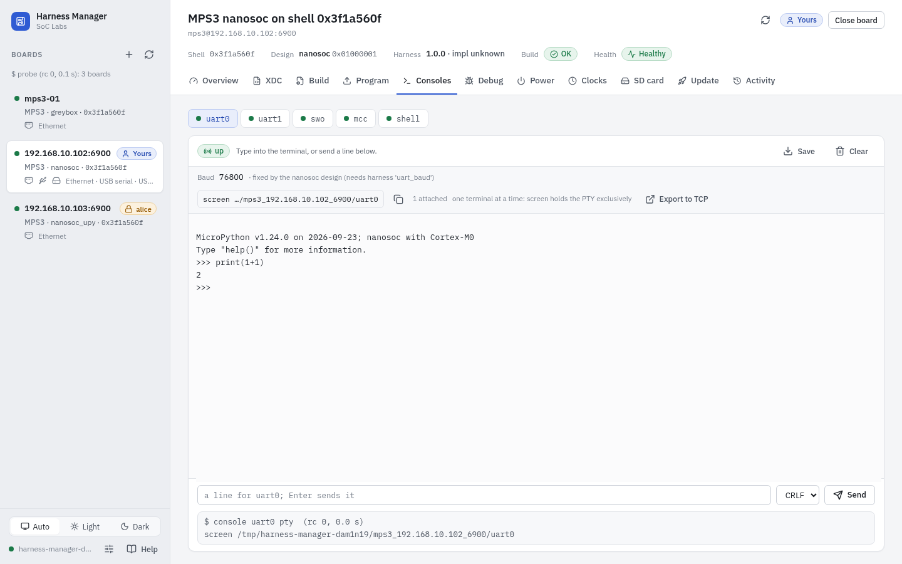

**On the command line**

| Command | What it does |
|---|---|
| `console TARGET uart0` | the console in this terminal; Ctrl-] exits |
| `console TARGET uart0 --read-only` | output only; no keystrokes sent |
| `console TARGET uart0 --export 0` | re-export on a free local port (prints it), for PuTTY and similar |
| `pty TARGET uart0` | make a terminal device and print the `screen` command |
| `baud TARGET NAME [RATE]` | show a console's rate, or change it where it can change (0 = default) |

```bash
harness-manager console 192.168.10.101 uart0
screen /tmp/harness-manager-$USER/<board>/uart0      # Linux and macOS
```

The app and one `screen` can show the same console at once. `screen` needs no baud
argument for the Ethernet consoles. For a serial console, the command HM gives carries the
rate, because `screen` alone sets 9600.

Input to `uart0` and `uart1` is paced at 20 ms a byte, because the nanoSoC UART has no
receive FIFO. A paste arrives intact, but slowly.

**Reset the DUT from the console.** In `console TARGET uart0`, press **Ctrl-]** then **r**:
the console asks `reset the DUT of <board>? r or y resets it`. Press **r** (or **y**) and the
DUT resets while the console stays open, so you see it boot. Any other key cancels. After
Ctrl-], any key but r exits at once; Ctrl-] alone exits after 2 s.

This is the way to reset while a console is open. A console holds the board (one process
owns a board), so `harness-manager reset TARGET` from another terminal is refused (exit 4,
"your own `harness-manager console uart0` … holds it"). The one exception: when the
Harness Manager service runs (the app, or `harness-manager daemon start`) **before** you open
the console, both terminals share its session and `reset` works.

**What can go wrong**
- **Windows has no `screen`:** use the app, or `--export 0` and a raw TCP terminal.
- **One `screen` per console.** A second one is refused.
- **`reset` refused (exit 4) while a console is open:** the console holds the board. Reset
  from the console (Ctrl-] then r, r), or start the service before the console (above).
- **An unknown console name** exits 3 and lists the names.

## 6. Program a design

**Needs:** a board. Behind a hub, hold the lease ([section 4](#4-leases-share-a-lab-board)).

**When:** to load a design (an overlay) into the DUT partition, or go back to the baseline.

**In the app:** **Program** (or **Program…** on the Design tile).
1. Pick an overlay in **Overlays**. It lists those that load on this shell, and those that
   do not, with the reason.
2. Read **Preflight**. A MISMATCH refuses; UNCHECKED items are shown, not passed.
3. Tick **Arm** ("I understand this reconfigures the partition and resets the DUT").
4. Click **Program**. **Progress** shows each phase, then "Done. rm_id … is verified by the
   board".

**Restore baseline** loads the safe design (the greybox) and confirms it.

On a claimed Linux board, Program and Restore baseline first stop OpenOCD on the board (below).
When that fails, the outcome says why and **Program anyway** (or **Restore anyway**) appears:
tick **Arm**, then click it to swap all the same.

**On the command line**

```bash
harness-manager overlays 192.168.10.101           # what loads on this shell
harness-manager program 192.168.10.101 nanosoc    # preflight, ask, push, verify
harness-manager restore 192.168.10.101            # back to the baseline
```

| Option | Use |
|---|---|
| `--yes` | do not ask (scripts need it: see below) |
| `--keep-on-card` | also keep it on the board's user microSD, so the board boots into it next time |
| `--force` | swap even when OpenOCD on the board cannot be stopped first (a warning instead of exit 15); `restore` takes it too |
| `--overlay-dir DIR` | look for overlays here first (repeatable) |

A design is chosen by name (`nanosoc`) or by rm_id (`0x01000001`).

**Scripts need `--yes`.** `program` asks `program nanosoc (0x01000001) into <board>? [y/N]`
before it pushes. In a script nobody answers: an empty or closed stdin counts as no, so it
prints `not confirmed` and exits 15, having changed nothing. A script runs
`harness-manager program TARGET nanosoc --yes`. `restore` does not ask.

**`restore` needs the greybox.** HM looks for the greybox built for the board's shell in the
overlay directories and among the imported overlays. A kit carries no overlays, so after
`kit import` and `kit pack --import` a home has your RM but no greybox, and `restore` exits 3.
Give HM the folder of overlays built with the shell's mint (it holds `greybox/manifest.json`):
- once: `harness-manager restore TARGET --overlay-dir DIR`;
- for good: `harness-manager config set mps3.overlay_dirs DIR` (the app: Settings >
  Harness + kits > Extra overlay directories).

The message names the shell and where HM looked.

**How long a push takes** depends on the harness. Measured on the lab boards:

| Harness | Design (pair size) | Measured | Evidence |
|---|---|---|---|
| Linux | `greybox` (1.4 MB) | 38.7–45.5 s (20 restores) | `docs/evidence/2026-09-hil-auto/0928-b2-run2/iter-*/z2_restore.json` |
| Linux | `nanosoc` (2.5 MB) | 73.2 s (once) | `docs/evidence/2026-09-28-hil/b2_dbg_program_nanosoc.txt` |
| Linux | `nanosoc_ila` (2.8 MB) | 67.2–79.1 s (21 pushes) | `…/0928-b2-run2/iter-*/e1_program_ila.json`, `docs/evidence/2026-09-28-hil/b2_e1_program_ila.txt` |
| bare metal | 13 designs | 3–7 s each | the platform repo's `docs/evidence/2026-09-w3/sweep_20260924.txt` (tag v1.1.0) |

The Linux times are HM's own `seconds`, through the hub (board 2, 28–29 Sep). Timed from
the command's start, the longest was 80.6 s. The bare-metal times are pyverify's windowed
push, run on the hub (24 Sep). HM's own push on bare metal has no recorded time.

**Keep on the card.** **Needs:** the Linux harness and a card in the USER microSD slot.
Tick **Keep on the card** in Program, or add `--keep-on-card`. After the load is confirmed,
HM writes the design to the card and says which slot it went to ("Kept on the card (slot
B)"). It is off by default: a plain program never writes the card. Without a card store
or a card, it refuses before writing anything, with the reason. A card write that fails
does not fail the program: the new design runs, and the card keeps the one it had.

**Related:** reset the DUT with `harness-manager reset 192.168.10.101` (the Board tile's
**Reset DUT**, after ticking **Arm**). Set its clock with
`harness-manager clock 192.168.10.101 --dut-mhz 50` or `--preset 25mhz` (the **Clocks**
section).

**What can go wrong**

| You see | Cause | Do |
|---|---|---|
| exit 14, MISMATCH on the shell | the overlay was built for another shell | build or fetch it for this shell ([section 7](#7-build-your-own-dut)) |
| exit 15 | a corrupt payload or unpaired files | rebuild or re-fetch the overlay |
| exit 6, "Written, not verified" | the board did not confirm the load | run `info`; then `restore` |
| `busy` right after a failed push | the harness is finishing that swap, for up to 30 s | wait 30 s, then try again |
| exit 12 with `--keep-on-card` | no card store (bare metal) or no card | program without it, or insert a card |
| exit 15, `not confirmed` | no terminal answered the [y/N] prompt (a script) | add `--yes` |
| exit 15, "`mps3-debug down` failed before the swap" | on a claimed Linux board, OpenOCD on the board could not be stopped first (its SSH did not answer, or the launcher failed); nothing was programmed | retry; or add `--force` (the app: **Program anyway**). On Linux v2.0.0 the board's OpenOCD may then still drive JTAG during the swap |
| `restore`: exit 3, `no baseline overlay (greybox) for shell …` | no greybox for this shell in the overlay directories or the store | `--overlay-dir DIR` or `config set mps3.overlay_dirs DIR` (above) |

On the Linux harness a push always uses TCP. It gives up when a chunk waits more than 30 s
(the harness parks the design behind the outgoing clearing); the whole push takes longer
(the times above).

## 7. Build your own DUT

**Needs:** the Vivado release the static was built with (2024.1 for 0x72BB0A36, 2026.1
for RC2 0x44EE76D5) on this machine, and the build kit for the board's static (the
shell). A board is optional: you can build for a static id with no board.

**When:** you have your own RTL and want it as an overlay you can Program.

The journey reads left to right in the app: **XDC**, then **Build**, then **Program**.

### 7.1 XDC: the constraints for your design

**In the app:** the **XDC** section. **Pin model** shows the board, the fielded shell and
the sources. **Export** has two kits:

| Kit | For | Holds |
|---|---|---|
| **RM kit** | a module that loads into the shell's partition | OOC XDC by boundary group, connectivity sheet, pblock facts, wrapper skeleton |
| **Full board** | a whole-FPGA design (replaces the harness) | pins, IO standards by bank, clocks |

Pick a built-in design (or tick **Paste my own design (JSON)**), then **Preview** or
**Download zip**. A kit that fails a check is shown, but not exported, until the check is
fixed.

**On the command line**

```bash
harness-manager xdc info                                            # the model and the built-in designs
harness-manager xdc rm-kit --design nanosoc --out ~/kits/nanosoc    # an RM kit
harness-manager xdc board --design blinky --out ~/kits/blinky       # a full-board export
```

Built-in designs today: `minimal`, `nanosoc`, `nanosoc_ila` (RM kits) and `blinky`,
`shield_gpio`, `harness_shell` (full board). `--design FILE.json` takes your own design;
[XDC_EXPORT.md](XDC_EXPORT.md) has the format. `--static-id ID` builds an RM kit for
another shell.

### 7.2 Build: from RTL to an overlay

**In the app:** the **Build** section. It shows six steps, each with its state (done,
next, blocked, failed or unchecked) and what to do next:

| Step | What it checks |
|---|---|
| 1 Target | the board's static and partition (47 ports, 148 bits on 0x72BB0A36) |
| 2 Tools | the Vivado release the kit needs, and the one found here |
| 3 Kit | the static's build kit is in the cache and its CRC matches the static id |
| 4 Wrapper and XDC | your design passes the XDC checks; its rm_id |
| 5 Build | **Generate script** writes `build_rm.tcl`; you run Vivado |
| 6 Check and add | **Check** the build receipt, then **Add to Program** |

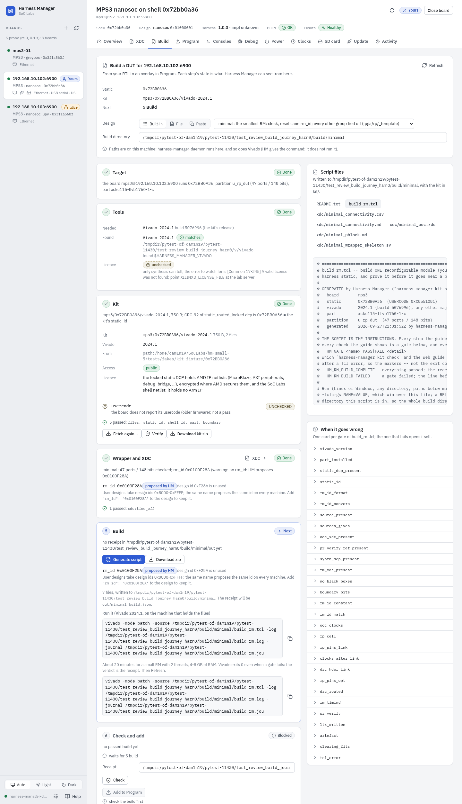

**On the command line.** A typical run for the board at `192.168.10.101`:

1. See where you are: `harness-manager kit guide 192.168.10.101 --design minimal`
2. Get the kit: `harness-manager kit fetch 192.168.10.101`, or import one you were given:
   `harness-manager kit import ~/Downloads/0x72BB0A36-kit.zip`
3. Write the build directory: `harness-manager kit script 192.168.10.101 --design minimal --out ~/builds/minimal`
4. Print the Vivado command, then run it: `harness-manager kit build ~/builds/minimal`
5. Check the result: `harness-manager kit check ~/builds/minimal 192.168.10.101`
6. Make it an overlay in Program: `harness-manager kit pack ~/builds/minimal --import`

With no board, give `--static-id 0x72BB0A36` instead of the address.

**Your own RTL: the design's `build` object.** The built-in designs (`minimal`, `nanosoc`,
`nanosoc_ila`) describe the partition's ports and timing only. To build your DUT, write a
design `.json` (docs/XDC_EXPORT.md, "An RM design") and add `rm_id` and `build`. Every
path is relative to the design file, or absolute:

```json
{
 "kind": "rm", "name": "my_soc", "rm_id": "0x01008001",
 "use": {"clkrst": {}, "jtag": {}, "uart": {}, "status": {}, "gpio": {}},
 "clocks": ["jtag_tck"],
 "wrapper": "rtl/rp_my_soc_wrapper.sv",
 "build": {
  "top": "rp_my_soc_wrapper",
  "sources": ["rtl/my_pkg.sv", "rtl/my_core.v", "rtl/rp_my_soc_wrapper.sv"],
  "include_dirs": ["rtl/include"],
  "defines": ["RAM_PRELOAD"],
  "generics": {"IMEM_IMG": {"path": "fw/image.hex"}, "NCORES": 1}
 }
}
```

| Key | What it is |
|---|---|
| `top` | the RM's top module; default `rm_<name>` (the skeleton's) |
| `sources` | HDL files, **in compile order** (a SystemVerilog package before its users). `.vhd`/`.vhdl` are read as VHDL, `.v` as Verilog-2001, anything else as SystemVerilog. List every file: there are no globs. A `.hex`, `.xci`, `.xdc`, `.tcl` or `.dcp` here is refused with the key that takes it |
| `include_dirs` | `` `include `` search directories |
| `defines` | `` `define `` names (`NAME` or `NAME=VALUE`) |
| `generics` | top-level parameters, `{NAME: value}`: a string, a number, or `{"path": FILE}` for a `$readmemh` image. A path is written absolute (Vivado's working directory is not yours) and a missing file stops the build at preflight (Vivado itself only warns, and builds a blank memory) |
| `synth_hook` | a Tcl file sourced inside the synthesis project, after `sources`: a filelist of your own, `read_ip` for Xilinx IP, `set_property` |
| `synth_dcp` | skip synthesis: an out-of-context synth checkpoint of `top`, written before any `create_clock` is read into it (a clock in it overwrites the static's clock of the same name at the link) |
| `rm_xdc` | RM-internal timing exceptions and floorplan (child pblocks from `hm_save_floorplan`), read with `read_xdc -cell` after the link |

A design with no `sources`, no `synth_hook` and no `synth_dcp` builds as its skeleton only
when that skeleton is a whole RM (`minimal`). Otherwise `kit script` names the outputs the
skeleton leaves undriven, and the build stops at preflight until you give the RTL.

| Kit command | What it does |
|---|---|
| `kit info [TARGET]` | the static, its kit, the Vivado it needs, the sources |
| `kit fetch [TARGET] [--source cache\|channel\|hub\|PATH] [--out DIR]` | put the kit in the cache (and export it) |
| `kit import DIR\|ZIP` | a kit directory or zip, or a `fielded/<sid>/` directory, into the cache |
| `kit list` | the cached kits |
| `kit verify DIR\|ZIP [TARGET]` | check a kit directory or a kit zip (nothing is cached), and it against a board |
| `kit guide [TARGET] [--design D] [--build-dir DIR] [--why GATE]` | the steps and their state; `--why` explains one gate |
| `kit script [TARGET] --design D --out DIR` | write `build_rm.tcl`, the kit and the XDC kit |
| `kit build DIR [--stop-after STAGE] [--gui]` | print the Vivado command, with the full path of a Vivado of the kit's release (HM does not run Vivado yet), and the Tcl line for a Vivado that is already open; `--gui`: the GUI command; exit 12 when there is none |
| `kit check RECEIPT\|DIR\|PARTIAL [TARGET] [--static-id ID]` | check a build receipt and its pair, or a bare partial; `--static-id` must be the receipt's static, or the check refuses (exit 14). A `STOP_AFTER` receipt reads "stopped after <stage>" (exit 0) |
| `kit pack RECEIPT\|DIR [--import]` | write the overlay; `--import` puts it in Program |

**Run it in your own Vivado.** Harness Manager does not run Vivado; you do. Besides batch,
three ways leave Vivado open after the script. All four run the same `build_rm.tcl`, with the
same gates and the same receipt:

| Way | How | After the script |
|---|---|---|
| Batch | the command `kit build DIR` prints first | Vivado exits |
| GUI | `kit build DIR --gui` prints `vivado -mode gui -source …` | the GUI stays open |
| Tcl shell | the batch command with `-mode tcl` | the `Vivado%` prompt stays open |
| A Vivado already open | its Tcl console: `cd {DIR}; set argv {STOP_AFTER=link}; source build_rm.tcl` (`kit build` prints this line) | the prompt stays open |

- `--stop-after preflight|synth|link|impl|verify` ends the build there. The receipt then says
  `stopped`: `kit check` reads it as "stopped after link", not a failure, and `kit guide` offers
  the command that runs the build to the end.
- In a Vivado already open, always `set argv` before `source`: the session keeps the last one,
  and the script reads it. A design already open there stays open beside the build's (about 3
  GB each): `close_project` it first.
- In that session the `HM_` lines go to its own log, not `build_rm.log`; the receipt
  (`out/<name>_build.json`) is the verdict either way.

**Floorplan: stop after link, nested pblocks via `rm_xdc`.** The partition's pblock
(`pblock_rp_dut`) is the static's and cannot move or grow, but your RM can have pblocks of its
own inside it:

1. `harness-manager kit build ~/builds/my_rm --gui --stop-after link`, and run the command.
   It stops with the linked design open.
2. Draw a pblock inside `pblock_rp_dut` and make it its child, in the GUI or its Tcl console:
   ```tcl
   create_pblock pblock_mine
   resize_pblock [get_pblocks pblock_mine] -add {SLICE_X80Y90:SLICE_X87Y104}
   set_property PARENT pblock_rp_dut [get_pblocks pblock_mine]
   add_cells_to_pblock [get_pblocks pblock_mine] [get_cells -hierarchical -filter {NAME =~ u_rp_dut/* && IS_PRIMITIVE && REF_NAME != GND && REF_NAME != VCC && NAME !~ *HD_PR_Connection* && NAME !~ *HD_Inserted*}]
   ```
3. Save it next to your design `.json`: `hm_save_floorplan ~/designs/my_rm_floorplan.xdc`
   (the script defines it). Do not use `write_xdc -cell u_rp_dut`: it also writes the
   partition's own pblock, which the next build reads as a second pblock over the same area
   that takes your cells out of `pblock_rp_dut` (placement then fails). Nor paste the lines
   the journal echoes: their full `u_rp_dut/…` cell names match nothing when the build reads
   the file, and the pblock stays empty.
4. Add `"rm_xdc": "my_rm_floorplan.xdc"` to the design's `build` object (a path relative to
   the design file), run `kit script` again, and build. The next link reads it into
   `pblock_rp_dut` as `u_rp_dut_pblock_mine`.

Limits: the child pblocks must lie inside the partition's ranges (on RC2
`SLICE_X48Y0:SLICE_X95Y119`, with its BRAM and DSP columns); the partition has no pads; and
your RM may hold no clock buffer, MMCM or BSCAN (use the shell's clocks and BSCAN legs).
Proven on Vivado 2026.1 with the RC2 kit: `docs/evidence/2026-09-30-kit-interactive`.

**Times.** Fetching a kit takes seconds from the cache. A build takes about 30 minutes for
a small RM on a quiet machine, up to an hour when the machine is loaded, and about 50
minutes for nanosoc, with 4 to 8 GB of RAM. Measured on srv03335: `minimal` 28-56 min at
load 33-50 (`docs/evidence/2026-09-29-kit-night`) and 30.5 min at load 4-9; nanosoc 48-55
min (`docs/evidence/2026-09-30-kit-nanosoc`).

**Timing.** The receipt's `rm_wns` and `rm_whs` are your RM's own paths (the `rm_timing`
gate). With no timed path inside the partition (`minimal`: every output a constant) they
are empty, and `rm_timing_note` says so with the whole design's WNS and WHS from
`out/<name>_timing.rpt`; `kit check` prints the same line (`timing`).

**What can go wrong**
- **No kit:** the kit sources are the cache, the signed channel (not live yet), the hub's
  mint archive (`HARNESS_MANAGER_KIT_HUB_DIR`), or a path you give. Ask SoC Labs for the
  kit zip and use `kit import`.
- **Vivado release:** the generated `build_rm.tcl` refuses another major.minor than the
  kit's. HM finds Vivado in `tools.vivado` (or `HARNESS_MANAGER_VIVADO`: the `vivado`
  executable, or its install directory such as `/research/CAD/Xilinx/Vivado/2026.1`), on
  PATH, and under the install roots, in both layouts: `<root>/<release>/bin/vivado`
  (2024.x) and `<root>/<release>/Vivado/bin/vivado` (2025.1 and later). With no setting,
  an installed Vivado of the kit's release wins over another release on PATH.
- **The `vivado` on PATH is another release.** A login profile can put 2024.1 first on
  PATH. `kit build` and `kit script` print the full path of the right one, and the guide's
  **Tools** step stays at next until PATH agrees: run the full path, or
  `export PATH=<its bin>:$PATH`.
- **No RTL in the design:** `minimal` names none, so `kit script` builds its wrapper
  skeleton (`xdc/minimal_wrapper_skeleton.sv`: `rm_id` driven, every other output tied off)
  and says so.
- **Licence:** the device licence for the xcku115 is needed from synthesis on: Vivado 2026.1
  Core or higher (2024.1: Enterprise); the statics' IP needs none. Only synthesis can check
  it, so the guide shows it *unchecked*. Watch for `[Common 17-345] A valid license was not
  found`, and point `XILINXD_LICENSE_FILE` at the lab server. Vivado 2026.1 does not even
  start without a licence file (exit 42): the guide launches the kit's Vivado once and fails
  its **Tools** step with the `export` to run.
- **A build takes a while.** While Vivado runs, the guide's Build step says "a build is
  running here" with the stage, and offers no command: a second Vivado in the same
  directory would overwrite `out/`. nanosoc took 48-55 minutes on a shared, loaded server.
- **Vivado exits 0 even when a gate fails.** The receipt's `state` is the verdict. In
  `build_rm.log` it is the last line that *starts* with `HM_RM_BUILD_`
  (`grep -E '^HM_RM_BUILD_' build_rm.log | tail -1`): the log also echoes the script, so
  the text `HM_RM_BUILD_FAILED gate=` stands in it after a real `HM_RM_BUILD_COMPLETE`. The **When it goes
  wrong** card (or `kit guide --why GATE`) has one fix per gate.
- **rm_id:** a design with no `rm_id` gets a proposed one (design ids `0x8000` to `0xFFFF`,
  the same on every machine for the same name). Add it to your design to keep it.
- **Paths are on the service's machine.** The service and Vivado run on the same host.

## 8. Debug: OpenOCD and XVC

**Needs:** a board with a debug-capable design loaded (nanosoc; the greybox has no debug
port). Behind a hub, hold the lease (HM refuses XVC without it).

The **Debug** section has two cards: **DUT debug (OpenOCD)** for the DUT CPU, and **Fabric
debug (XVC)** for ILAs in the partition.

**A claimed Linux board** serves JTAG and XVC only over SSH to the board itself. On a board
you claimed from this Harness Manager, both go through that SSH for you; on one claimed by
another key they are refused before anything connects (exit 15; `board claim TARGET
--adopt` if the claim is yours). See 12.1.

### 8.1 The DUT CPU: OpenOCD and gdb

**Where OpenOCD runs.** Two places, and HM picks one for you:

- **On the board** (a Linux harness you claimed, 12.1, whose image has OpenOCD and
  `mps3-debug`, v7 or later). The board runs OpenOCD itself; gdb reaches it through the
  board's SSH, over the same forward HM already keeps for the claimed board. You need **no
  OpenOCD on your PC**, only gdb.
- **On this PC** (every other board: bare metal, an unclaimed board, an older image). HM runs
  OpenOCD here, on the board's JTAG port (6921). This needs OpenOCD with remote_bitbang (below).

`debug status` says which (`where`), and so does the app's Connection card ("OpenOCD: on the
board" or "on this PC"). The setting **`debug.on_board`** (Settings → Debug, or `harness-manager
config set debug.on_board VALUE`) chooses:

| Value | What HM does |
|---|---|
| `auto` (default) | on the board when it is a claimed Linux board with `mps3-debug`; else on this PC |
| `true` | on the board, or it refuses and says why: exit 12 (no `mps3-debug` on the board, or bare metal), exit 15 (not claimed here, or claimed by another key) |
| `false` | on this PC only |

HM asks the board once per session whether it has `mps3-debug` (`mps3-debug status --json`
over its SSH).

**A two-core design** (nanosoc_multicore) runs on the board only: HM prints one gdb port and
one `attach` line per core (cpu0, cpu1). Attach one gdb per core, each in its own terminal:

```text
gdb        127.0.0.1:40211  cpu0
gdb        127.0.0.1:40212  cpu1
attach     arm-none-eabi-gdb -ex "set remotetimeout 60" -ex "target extended-remote 127.0.0.1:40211"
attach     arm-none-eabi-gdb -ex "set remotetimeout 60" -ex "target extended-remote 127.0.0.1:40212"
```

On the board, OpenOCD's telnet and Tcl ports stay on the board: HM forwards gdb only.

**On-board: what can go wrong**
- **Exit 4, "OpenOCD is running on the board (on-board session)":** you asked for this PC's
  OpenOCD while the board's own holds JTAG. Use it (`debug status`), or stop it
  (`harness-manager debug down TARGET`).
- **Exit 4, held by another client:** the message names who holds the board's JTAG.
- **Exit 4, the lease:** behind a hub, the board's OpenOCD is for the lease holder (as XVC).
- **Exit 13:** the loaded design has no debug port. **Exit 14:** the board's OpenOCD has no
  config for this design. HM passes the design's name; for a design it does not know it
  passes `auto`, and the board may not know it either.
- **Exit 6:** OpenOCD did not start on the board; the message ends with its log.
- **Every program or restore stops the board's OpenOCD first** (`mps3-debug down`, over the
  claim's SSH), whoever started it: HM, another terminal, or `mps3-debug up` by hand, and
  whatever `debug.on_board` says. `debug status` then says "closed for the swap", and a
  session HM had open reopens after a verified swap. If the board cannot be asked or its
  OpenOCD does not stop, the program is refused (exit 15) and nothing is programmed: retry,
  or add `--force` (the app: **Program anyway**) to swap anyway; on Linux v2.0.0 the board's
  OpenOCD may then still drive JTAG during the reconfiguration. An idle one stops by itself
  after 2 hours on the board.

**This PC's OpenOCD: needs** OpenOCD 0.12 or later, built with the **remote_bitbang**
adapter, on your PATH or in `tools.openocd`. The MPS3 target configs ship with Harness Manager.

Most builds have remote_bitbang, but not all: the SoC Labs build has only jlink, buspirate
and hostio4. Check yours (it loads no config and touches no hardware):

```bash
openocd -c "adapter list" -c shutdown 2>&1 | grep remote_bitbang
```

No line means no remote_bitbang. We recommend **xPack OpenOCD 0.12** (the build the lab hub
uses). HM checks this itself before it starts OpenOCD: a configured OpenOCD without
remote_bitbang is refused, and with none configured HM takes the first `openocd` on PATH
that has it. `debug status` shows which one it would use.

**In the app:** **Detect** reads the TAP IDCODE only: no reset, no halt, no register
written. **Open session** starts OpenOCD for the loaded design; **Connection** shows the
gdb, telnet and tcl ports (127.0.0.1 only). **Close session** stops it. The Overview's
Debug tile has **Start** and **Stop**.

**On the command line**

| Command | What it does |
|---|---|
| `debug detect TARGET` | the TAP IDCODE (exit 13: the design has no debug port) |
| `debug up TARGET` | start OpenOCD, print the ports and the gdb line (`attach`), hold until Ctrl-C |
| `debug status TARGET` | state, ports, config, pid, and which OpenOCD (does it have remote_bitbang?; not printed when OpenOCD runs on the board) |
| `debug down TARGET` | stop it |

**`debug up` holds its terminal.** It runs in the foreground: the server lives while it
runs, and Ctrl-C (or `harness-manager detach TARGET`) stops it. So run gdb in a **second
terminal**. A program closes the session; after a verified swap it reopens on new ports, and
the holding terminal prints them (`swap       reopened after the swap: the gdb ports below are
new; attach gdb again`, then the new `gdb` and `attach` lines). After a swap that was not
verified it prints `swap       not reopened: …`. There is no `--background`; to keep a session up without a terminal, use **Open
session** in the app (the service owns it until **Close session**).

**Connect gdb with the line `debug up` prints** (`attach`), for example:

```bash
arm-none-eabi-gdb -ex "set remotetimeout 60" -ex "target extended-remote 127.0.0.1:23344"
```

`set remotetimeout 60` is needed through a hub or a claimed Linux board's SSH: gdb's default
2 s reply timeout fails the attach there ("Remote replied unexpectedly to 'vMustReplyEmpty':
timeout"; board 2, 30 Sep). It is on the line for every board: a board that answers fast
behaves the same, and only a dead link takes longer to report (Ctrl-C in gdb gives up
sooner). OpenOCD may still print `keep_alive() was not invoked in the 1000 ms timelimit`
through a hub: a warning, not a failure. The app's **Attach** row copies the same line.

Arm DS uses the same port
through its "Generic GDB" connection. The session closes by itself before a partition
swap, and reopens after a verified one.

**Back-to-back sessions.** The board's JTAG server takes one client, and needs a moment
to finish the last session before it takes the next. So HM waits until 2 seconds after
its previous OpenOCD on that board ended before it starts another. You see a short pause
on `debug up` right after `debug detect`, or after closing a session. If the board still
turns the new one away within 5 seconds of HM's own session, HM retries once by itself.

**What can go wrong**
- **"OpenOCD not found":** install it, or set `HARNESS_MANAGER_OPENOCD` to its path.
- **Exit 12, "has no remote_bitbang adapter":** that OpenOCD was built without it. The
  message names the binary and the adapters it has. Install xPack OpenOCD 0.12, then set
  `tools.openocd` (Settings → Tools, or `harness-manager config set tools.openocd PATH`).
  If `HARNESS_MANAGER_OPENOCD` is set, it overrides the setting: point it at the new one
  or unset it. It is the SERVICE's variable that counts, and the service keeps the
  environment of the shell that started it (an app or `ui` from another shell reuses the
  running service). `harness-manager daemon status` lists the variables the service
  started with, as do Settings → Advanced and a warning line in the app. To drop one:
  `harness-manager daemon stop`, then start the app from a shell without it.
- **Exit 4, held:** another debugger has the board's JTAG port. The hint may add "or the
  harness's JTAG server is still finishing the previous session": wait a few seconds and
  retry.
- **Exit 13:** the loaded design has no debug port. Program one that has (nanosoc).

### 8.2 ILAs: fabric debug over XVC

**Needs:** Vivado (the Lab Edition is enough) or your own hw_server; a design with ILAs in
the partition (`nanosoc_ila`); the harness's XVC with its Debug Bridge. Behind a hub, the
lease.

XVC here reaches only the reconfigurable partition's debug chain: the harness's Debug
Bridge and the loaded design's debug hub and ILAs. It is never whole-device JTAG: it
cannot configure or read back the FPGA.

**In the app:** **Debug > Fabric debug (XVC)**.
1. Click **Open**. HM takes the board's one XVC slot, starts its own hw_server, and shows the
   **Vivado** URL (`localhost:23707`). To use your own hw_server instead, tick **Bring your
   own hw_server** first (it starts ticked when **Settings > Debug** `debug.hw_server_mode` is
   `byo`). Behind a hub, **Open** is for this Harness Manager holding the lease.
2. Click **Copy Tcl** and paste it into Vivado's Tcl console. It connects to that URL and
   opens the target.
3. **Download .ltx** gives the probes file for the loaded design.
4. **Close** kicks the client, stops hw_server, and frees the board's slot.

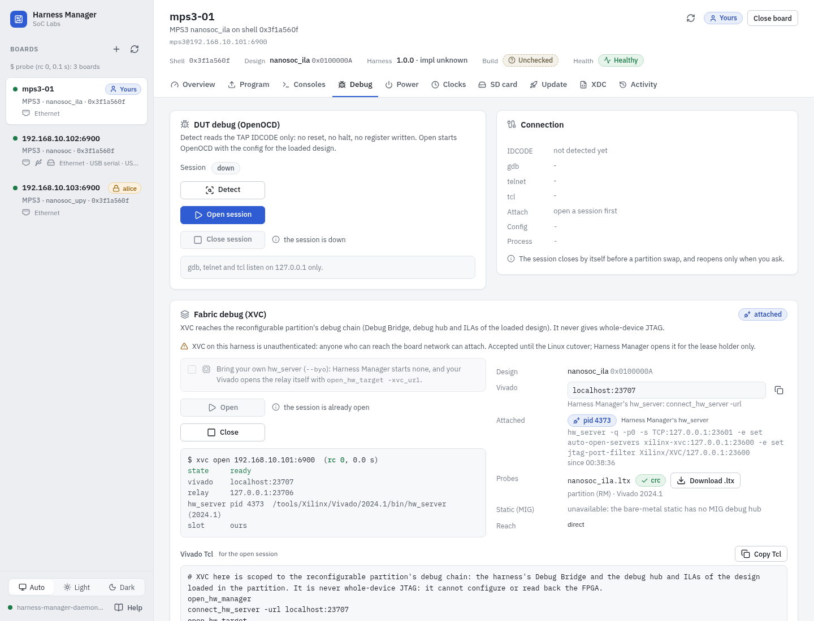

**On the command line**

```bash
harness-manager xvc open 192.168.10.101          # the app has the board open: returns at once
harness-manager xvc tcl 192.168.10.101           # the Vivado Tcl for what is loaded
harness-manager xvc ltx 192.168.10.101 -o nanosoc_ila.ltx
harness-manager xvc status 192.168.10.101
harness-manager xvc close 192.168.10.101
```

| Option | Use |
|---|---|
| `--byo` | bring your own hw_server: HM runs only the relay, and Vivado opens it with `open_hw_target -xvc_url 127.0.0.1:R` |
| `xvc ltx --rm` / `--static` / `--full` | the RM's probes file, the static's (the MIG view, Linux harness only), or the full-design one |
| `--for SECONDS` | hold the session this long, then stop |

`xvc open` returns at once when the app already has the board open; the session stays
there until `xvc close` or you close the board. Otherwise it holds the session in the
terminal until Ctrl-C, like `debug up`.

**Across a swap:** HM drops the slot and stops its hw_server before the partition swap,
then reopens the session with a fresh hw_server on the same port and the new design's
probes file. Vivado reconnects to the same URL; re-run the probes lines of `xvc tcl` to
load the new probes.

**What can go wrong**
- **"hw_server not found":** install Vivado or the Lab Edition, set
  `HARNESS_MANAGER_HW_SERVER`, or open with `--byo`.
- **The ILAs do not show:** hw_server must be the Vivado release the design's ILAs were
  built with. Point `HARNESS_MANAGER_HW_SERVER` at that release's `hw_server`.
- **Held:** another client holds the board's one XVC slot, or (behind a hub) you do not
  hold the lease.
- **With `--byo`, your hw_server lingers 20 s** after its last client. Reusing it after a
  swap gave "No devices detected": wait, or start a fresh one.
- **"XVC on this harness is unauthenticated":** the bare-metal harness's XVC accepts
  anyone who can reach the board network. HM opens it for the lease holder only. The
  Linux harness closes this once it reports its XVC lock.

[design/XVC_DEBUG.md](design/XVC_DEBUG.md) has the design.

## 9. The front panel

**Needs:** a board. What the card shows depends on what the board's harness image reports:
the panel's own text needs the harness feature `panel`, who is connected needs `presence`,
Identify needs `locate`, and the Live display needs the Linux harness with `lcd_mirror`.

**When:** to see what the board's LCD shows, or to find the board in the lab.

**In the app:** the Overview's **Board** tile has a **Panel** line (page, owner, touch) and
**Identify**. **Details > Front panel** starts with one headline that says what the card
shows:

| Headline | Means |
|---|---|
| **Live** | the Live display has the board's own picture |
| **Read** | the text was read from the panel ("Read from the panel, 3 s ago") |
| **Rebuilt** | this image does not send its panel's text, so Harness Manager rebuilt it from what it read. A fact it did not read shows as "—" ("not reported by this image") |
| **Not available** | the reason, in plain words |

Then the Live display, with the text mirror under it when there is no live picture, the rows
the image reports (owner, page, touch, who is connected, recent taps), Identify with a choice
of 5 to 30 seconds (it starts at **Settings > General > How long the Front panel's Identify
blinks**, 5 s unless you change it; the sidebar's and the Board tile's one-click Identify
always blink 5 s), and one line **Not reported by this image: ...** for the rest. Open that
line for the harness features each one needs, and for the harness type as the harness itself
reports it (`version.impl`).
Harness Manager never guesses the type from a missing feature: a Linux image may lack
`panel` too.

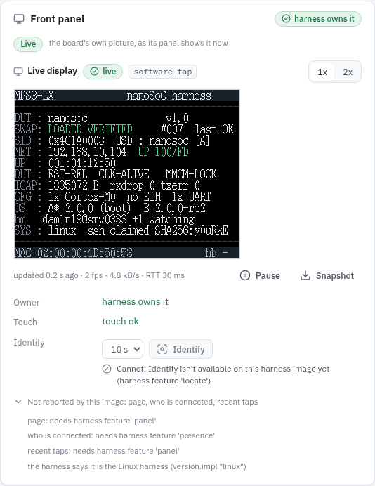

**Which board is which? Identify.** Every board card in the sidebar has a small Identify
icon (a magnifier), and so does the Board tile.
1. Click it. The board's panel backlight blinks for 5 seconds. While the harness owns
   the panel, it also shows "IDENTIFY: you@yourhost via Harness Manager".
2. Watch the icon count down 5-4-3-2-1. The small square beside the count stops it.

You do not need to open the board or hold its hub lease. What to expect:
- **Once every 10 s per board.** The icon says when it can go again.
- **A second press while it blinks does nothing.**
- **A tap on the panel stops the blink.** The count in the app still runs to its end.
- **The DUT owns the panel:** only the backlight blinks, with no banner.
- **Disabled icon:** its tooltip says why, for example "Identify isn't available on this
  harness image yet (harness feature 'locate')", or "Not read yet" before a scan.
- **Never automatic:** Harness Manager sends it only when you click, or when you run
  `identify`.

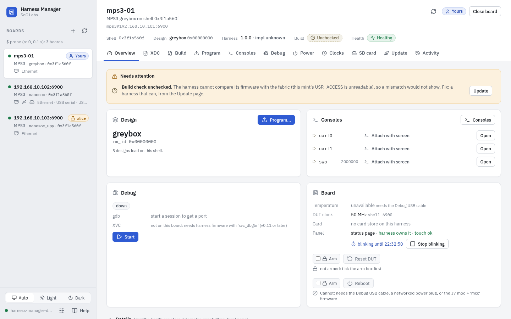

**On the command line**

| Command | What it does |
|---|---|
| `panel show TARGET` | page, owner, banner, card, sessions, taps, Identify |
| `panel mirror TARGET` | the panel's text grid |
| `identify TARGET [--seconds N]` | blink the board's panel so you can find it (1 to 30 s, default 5; 0 stops; exit 8 within 10 s of the last one) |

```bash
harness-manager identify 192.168.10.101 --seconds 20
```

**Presence.** For each board it has open, HM says hello to the board every 30 seconds, so
the panel lists who is connected. The board keeps a session for 90 seconds after its last
hello, and at most 4. Closing the board stops the hellos. The name shown is your
`user@host`. (The `panel.presence_who` setting will change it once it is wired:
[section 11](#11-settings).)

**Taps.** Someone at the board can tap the lease-request banner on the panel. That tells the
holder; it never releases the board.

**What can go wrong**
- **"Rebuilt":** the image has no `panel` (bare metal v0.11, and Linux images before the
  panel features). The text is rebuilt from what HM read; `NET` is the board's own address,
  never your SSH tunnel's `127.0.0.1`. Identify is disabled with "Identify isn't available
  on this harness image yet (harness feature 'locate')".
- **"Live display: checking your lease with the hub...":** the hub did not answer the
  lease read this time (its ssh server turns connections away when it is busy). The display
  asks again by itself and opens when the hub answers; **Details** shows the hub's own
  words. If the hub said a moment ago that the lease is yours, it opens straight away.
- **"Live display: the live display is for the lease holder only: alice holds ...":**
  someone else holds the lease. Ask for it (`lease request`).
- **"held" (violet):** someone else owns the panel, for example the DUT.
- **Touch unavailable:** the panel's touch controller did not answer; the reason says why.

## 10. Updates: the harness and the app

**Needs:** signed releases (not live yet). Until SoC Labs publishes them, `update check`
and `harness list` refuse every channel (exit 15), and the harness comes from SoC Labs as a bundle
([section 3.1](#31-a-board-on-your-desk)). This section is how it works once they exist.

Two things update separately:

| What | Where in the app | Command |
|---|---|---|
| the board's harness (config SD, overlays, OS image) | **Update > Harness versions** | `harness-manager harness …` |
| this app, Harness Manager itself | the banner at the top, and **Settings** | `harness-manager update app …` |

### 10.1 Harness versions

**Needs:** a board for install, pin and rollback. Behind a hub, the lease.

**When:** to move a board to another harness release, pin it, or go back.

**In the app:** **Update > Harness versions** lists every signed release, each with a
verdict for this board:

| Verdict | Means |
|---|---|
| fits | installs as it is |
| re-key | another static: every overlay and DUT RM keyed to the running static stops loading. You type `REKEY 0x…` to confirm |
| needs Debug USB or hub | the config SD must be written through the Debug USB here, or the hub |
| incompatible | it cannot go on this board; the reason says why |

**What changes** lists exactly what an install changes. **Install…** shows the plan and
asks. **Pin** keeps the board on a release (nothing newer is offered). **History** shows
the last installs. **Roll back** reinstalls the release the last install replaced.

**Running** is the catalogue's release the board runs; when its firmware reports another
number (the version verb, what `info` prints), it says "firmware reports 1.0.0" beside it,
and the header shows both. Behind a hub, installs are for this Harness Manager holding the
lease: a lease your hub name holds in another session is not enough (the lease line says so,
and the service refuses the install).

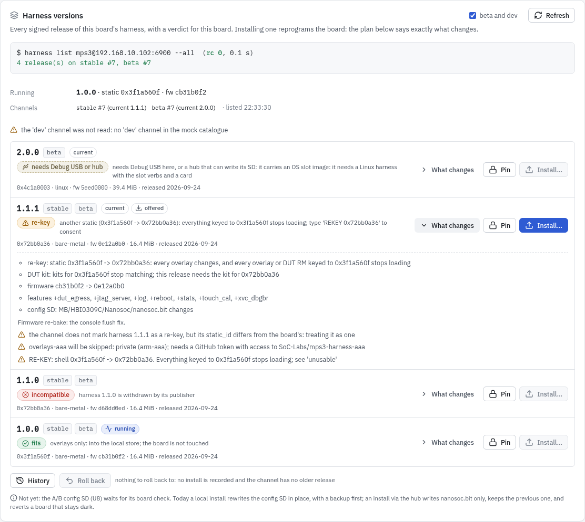

**On the command line**

| Command | What it does |
|---|---|
| `harness list [TARGET] [--all]` | the releases, with a verdict for TARGET (`--all`: stable, beta and dev) |
| `harness show VERSION [TARGET]` | one release: identity, parts, notes, what changes |
| `harness fetch VERSION [--kit]` | download and verify it into the cache now (`--kit`: also the DUT build kit, 10 to 40 MB) |
| `harness install TARGET [VERSION]` | install it (asks first) |
| `harness pin TARGET VERSION` / `harness unpin TARGET` | pin a board to a release, or remove the pin |
| `harness history TARGET` | the board's last installs, newest first |
| `harness rollback TARGET [--to previous\|VERSION]` | reinstall the previous release; `--backup ZIP` restores an SD backup instead |
| `harness mirror DIR [--all]` | write an offline mirror; `--source DIR` then reads it |

`update check`, `update harness` and `update rollback TARGET` are the older spelling and
still work.

**A re-key** needs the typed phrase the plan prints: in the app a text box, on the command
line `--consent "REKEY 0x72BB0A36"`. `--yes` never implies it.

**Install through the hub** (a lab board, with its Debug USB on the hub):
- Only the lease holder can install.
- The plan names the board, the lease holder and the queue, and you type that exact phrase:
  `INSTALL mps3_01_pl HELD BY you@host 0 QUEUED`. On the command line:
  `--door hub --board-phrase "INSTALL mps3_01_pl HELD BY you@host 0 QUEUED"`.
- fpgahub writes the config SD's `nanosoc.bit`, and the board is rebooted by the MCC on the
  hub (paced). A release that changes any other SD file needs the Debug USB here.
- The write itself takes about 70 seconds. Do not start a second install, or reset the
  board, while it runs.
- **Auto-revert** is on by default: if the board answers neither ping nor version for 60
  seconds after the reboot, HM writes the previous `nanosoc.bit` back and reboots again.
  Untick it (or `--no-auto-revert`) only when you will recover the board yourself.

**An OS image** (Linux harness) installs over Ethernet only when it is for the static the
board runs. Otherwise it needs the Debug USB or the hub.

**What can go wrong**
- **"cannot verify channel.json: this build has no pinned update-signing keys"** (exit
  15): no release key is published yet. Install the harness by hand
  ([section 3.1](#31-a-board-on-your-desk)).
- **Private parts** (Arm IP overlays) are skipped without a GitHub token that can read them:
  `harness-manager config set-secret updates.github_token`.
- **"written, not running":** the SD was written but the board did not come up on it. Roll
  back with `harness rollback TARGET`, or restore the SD backup ([section 14](#14-troubleshooting)).

### 10.2 The app itself

**When:** a banner says a new Harness Manager is available.

**In the app:**
1. The banner says "Harness Manager X is available". **Download** fetches it and builds it
   beside the running version. (In the default mode it downloads by itself.)
2. When it is ready: "Harness Manager X is ready: Restart to update". **Later** hides it
   until the next version.
3. Click **Restart to update**. If the restart would end a session (GDB, XVC or a `screen`
   on a console), it lists them and asks first. Running jobs finish first; hub leases are
   kept.
4. The restart takes a few seconds. The page reconnects by itself. Consoles keep their
   PTY paths: re-run `screen` on them.
5. If the new version fails its health check (30 s), the old one comes back by itself, and
   the new one is marked bad and never offered again.

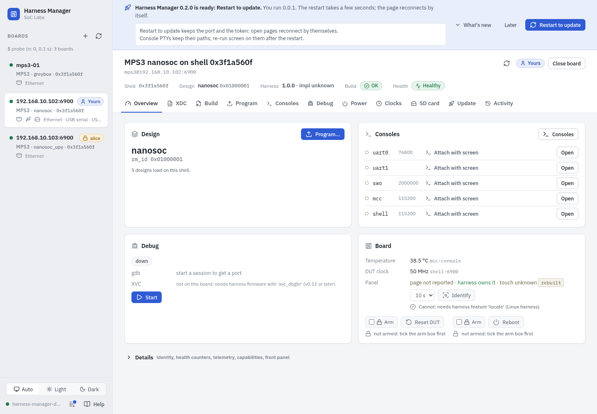

**Settings > Updates** sets the **Channel** (stable, beta, dev) and **Updates** (Off,
Notify, Stage), and lists bad versions. The service checks 60 seconds after it starts,
then every 6 hours.

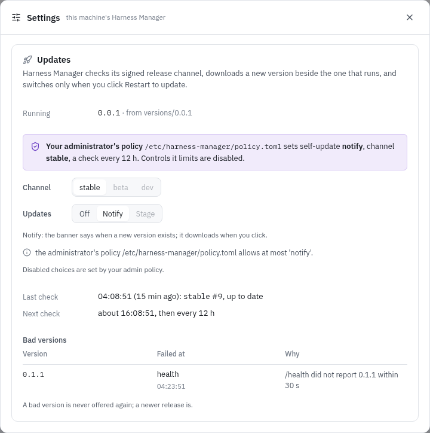

**On the command line**

| Command | What it does |
|---|---|
| `update status` | the app's versions, bad marks, last check and last apply |
| `update check` | read-only: what the channel offers |
| `update app` | download, stage beside the running one, and switch |
| `update app --stage-only` | build it, do not switch |
| `update app --apply` | with the service running: stage, then restart onto it (rolls back by itself if it fails) |
| `update rollback --app` | switch back to the previous app version |

**What can go wrong**
- **"this is a developer install":** a `make venv` or `pip install -e` copy never updates
  itself. Update it with git.
- **A version will not start:** `HARNESS_MANAGER_USE_INSTALLED=1 harness-manager update rollback --app`
  runs the installer's copy and switches back.
- **Choices are disabled:** your administrator's policy file limits them. The Settings card
  names the file.

[INSTALL.md](INSTALL.md#self-update-and-the-install-root) explains the install root, and
[RELEASING.md](RELEASING.md) how releases are made.

## 11. Settings

**When:** to point HM at your tools, change update behaviour, or set up hubs and secrets.

**Where settings live**

| File | Holds | Who writes it |
|---|---|---|
| `~/.config/harness-manager/settings.toml` | your settings (comments are kept) | you, `harness-manager config`, `hub add` |
| `~/.config/harness-manager/boards.toml` | boards: names, hubs, power plugs | you, `hub targets --add` |
| `/etc/harness-manager/policy.toml` (Linux) | your administrator's `[lock]`, `[default]` and `[hubs.*]` | your administrator |
| the OS keyring, else a 0600 file | secrets: hub tokens, the GitHub token | `config set-secret`, `hub add --token-stdin` |

`harness-manager config path` prints every path on your machine, and where a new secret
goes. The policy file is `/Library/Application Support/harness-manager/policy.toml` on
macOS and `%ProgramData%\harness-manager\policy.toml` on Windows.

**Which value wins:** the administrator's lock, then an environment variable, then your
file, then the administrator's default, then the board pack's, then the built-in
default. `config get` says where each value came from.

**On the command line**

| Command | What it does |
|---|---|
| `config list [SECTION]` | every setting, its value and where it came from |
| `config get KEY` | one setting: value, source, lock, and any variable that hides it |
| `config set KEY VALUE [KEY VALUE …]` | change settings, all or nothing |
| `config unset KEY` | remove your value: back to the administrator's or the default |
| `config set-secret KEY` | store a secret, read from stdin (never the command line) |
| `config unset-secret KEY` | remove a secret |
| `config path` | every file the settings use |
| `config test SECTION [NAME]` | prove a section works, changing nothing (`config test hubs lab`) |

```bash
harness-manager config list updates
harness-manager config set updates.channel beta
harness-manager config get tools.openocd
harness-manager config set-secret hubs.lab.token
```

Sections: general, hubs, boards, tools, updates, harness-kits, debug, consoles, advanced.
Each change says when it applies: **live** (at the next use), **reopen** (the next time a
board opens) or **restart** (the service must restart).

**What takes effect.** `config` and the Settings dialog read and store every setting. HM
reads these where it uses them (lane SET-WIRE): the tools (OpenOCD, Vivado, hw_server, uv),
the app window's browser, the update settings, source and mirrors, the GitHub token, named
hubs, the kit hub archive, the debug and XVC port bases, the MPS3 OpenOCD configs, overlay
folders and card timing (`mps3.slot.*`), and the service's port, address and log level. The
app reads three as defaults (FIX-PACK-4): `panel.identify_s` (the Front panel card's
Identify time), `consoles.line_ending` (what a console's send line sends with Enter; the
select beside it changes it for that console) and `debug.hw_server_mode` (the XVC card's
**Bring your own hw_server** box; the CLI's `xvc open` still takes `--byo`). A change
applies in an open page at once. A few rows are stored but not read yet: `consoles.scrollback`,
`consoles.font_size`, `kits.jobs` and `general.window_size`. `panel.presence_who` (the name
a board's panel shows for you) is not read either: the panel shows `user@host`, and the
dialog hides the row so it does not look like it works (`config` still lists it).

A variable in the service's environment still wins over your file. The common ones:

| Setting | Variable |
|---|---|
| `tools.openocd` | `HARNESS_MANAGER_OPENOCD` |
| `tools.vivado` | `HARNESS_MANAGER_VIVADO` |
| `tools.hw_server` | `HARNESS_MANAGER_HW_SERVER` |

**In the app:** **Settings** (the sliders icon at the bottom of the rail) is one dialog with
sections for General, Hubs, Boards, Tools, Updates, Harness & kits, Debug, Consoles and
Advanced. It opens on General, then on the section you last used in that window; the Update
tab's **Settings** button opens Updates. Each row says where its value comes from (default, yours, lab default, admin, the
pack, or a variable that overrides it), saves when you change it, and has **Reset**. A row
the policy locks is disabled and names the policy file.
- **Hubs:** add a hub, **Test connection**, **Add this board**
  ([section 3.2](#32-a-lab-board-behind-a-hub)).
- **Tools → Detect** finds OpenOCD, Vivado, hw_server and uv and runs only their version
  probe. OpenOCD must list the remote_bitbang adapter.
- **Advanced** shows the files in use and **The service's environment**: the
  `HARNESS_MANAGER_*` and tool variables the service started with, and which of your values
  each one hides (the same list as `harness-manager daemon status`).
- A change that needs the service restarted shows a banner with the command to restart it.

**For administrators: the policy file.** One file limits every user on a shared machine.
HM only reads it, and a user's settings cannot loosen it:

```toml
self_update = "notify"          # off | notify | stage (default stage)
channel = "stable"              # the only channel users may use
check_interval = "12h"

[lock]                          # fixed for every user
tools.vivado = "/tools/Xilinx/Vivado/2024.1/bin/vivado"

[default]                       # this machine's starting point; a user may change it
updates.mirrors = ["/lab/mirror"]

[hubs.lab]                      # a machine hub; each user sets their own token
host = "mapstone-dev.ecs.soton.ac.uk"
```

It fails closed: a file that cannot be read turns self-update off. Never put a token in it:
every user can read it, and a `token` in `[hubs.*]` is dropped. The update keys, the machine
hubs, and the locks and defaults of every setting HM reads are enforced (see "What takes
effect" above). [INSTALL.md](INSTALL.md#shared-lab-machines-the-administrators-policy)
has every key.

**What can go wrong**
- **Exit 15 on `config set`:** your administrator's policy locks that key. The message
  names the policy file.
- **Your value does not take effect:** a variable in the service's environment hides it.
  `config get KEY` shows the variable.
- **A secret stored in a keyring the service cannot reach** (a service started over ssh):
  `config get KEY` shows it as not reachable. Store it again from the same session, or use
  a `file:PATH` reference.
- **A settings file that does not parse** is refused and never overwritten. Fix the file
  by hand.

## 12. The Linux harness

**Needs:** the Linux harness on the board.

**When:** your board runs the Linux harness (a MicroBlaze V Linux static) instead of the
bare-metal one. `info` shows it. It adds:
- an SSH claim, so only your key changes the board;
- a user microSD with a power-on default design and two OS slots, A and B;
- Keep on the card ([section 6](#6-program-a-design)), Identify and the live panel mirror
  ([section 9](#9-the-front-panel));
- XVC over the board's SSH, and the static's MIG probes ([section 8.2](#82-ilas-fabric-debug-over-xvc)).

[HIL_LINUX.md](HIL_LINUX.md) is the lab's runbook that checks all of this on the lab board,
step by step, in about 70 minutes.

### 12.1 Claim the board (once)

A Linux harness ships unclaimed: its SSH takes keys only, and it has none. The first key
it is sent claims it, for good. After that it takes slot changes, card changes, JTAG
(`debug up`) and XVC only over that key's SSH, which HM uses for you.

**What goes over SSH to the board once it is claimed.** A claimed board refuses these to
anyone but itself, including everything that comes through the hub:

| You run | Refused through the hub with |
|---|---|
| `debug up` (JTAG 6921), `xvc open` (2542) | one line `… locked: board claimed (use ssh)`, then the close |
| `slot push`, `slot commit`, `slot rollback` | `slot locked: board claimed (use ssh)` (a push is closed unread) |
| `card clear`, `card commit`, **Keep on the card** | `usd locked: …` / `commit locked: …` |

On a board **you claimed from this Harness Manager** (or pinned with `--adopt`), HM sends
all of these through one SSH connection to the board (`ssh -J HUB root@BOARD -L …`), opened
when one of them needs it and closed when the last one is done. You do nothing extra.
On a board **claimed by another key**, they are refused before anything is sent (exit 15):
if the claim is yours, `board claim TARGET --adopt`. Bare metal and unclaimed boards go
the usual way, through the hub (or the LAN): XVC on an unclaimed Linux board too, since it
has no lock and no key on its SSH yet. Reads (`slot status`, `card status`, `info`, the
consoles) stay open.

**In the app:** the Board tile's **SSH** line shows "unclaimed", "claimed by you" or
"claimed by another key". **Claim this board**, then **Claim with my key**, claims it.

**On the command line**

```bash
harness-manager board claim 192.168.10.101 --key ~/.ssh/id_ed25519.pub   # asks first; behind a hub, needs the lease
harness-manager board claim-status 192.168.10.101
harness-manager board ssh 192.168.10.101                    # root on the board, through the hub
harness-manager board ssh 192.168.10.101 -c 'ls -l /persist'
harness-manager board ssh 192.168.10.101 -c 'uptime; logread | grep -E "harnessd|stage0"'
```

`-c` takes the whole line as **one** command for the board's shell, exactly as `ssh host 'CMD'`
sends it: pipes, `;` and quotes inside it reach the board intact (on Windows too).

The claim pins the board's SSH host key in `boards.toml` (`ssh.host_key`). A board that
answers with another key is refused.

| Situation | Use |
|---|---|
| you claimed it another way (pyverify, a runbook) | `board claim TARGET --adopt` pins it |
| the board was re-provisioned (a new card) | `board claim TARGET --replace-host-key` |
| you want the ssh command line, not a shell | `board ssh TARGET --print` |

`board claim` asks `[y/N]` first, with `--adopt` too. In a script nobody answers, so it
exits 15 (`not confirmed`) and changes nothing: add `--yes`, for example
`harness-manager board claim TARGET --adopt --key ~/.ssh/id_ed25519.pub --yes`. `--key` takes
the **public** key (`.pub`).

Nothing claims a board by itself.

### 12.2 The user microSD

**In the app:** the Board tile's **Card** line shows the card, its power-on default and
the OS slots.

| Command | What it does |
|---|---|
| `card status TARGET` | present, the store, the power-on default, the OS slots |
| `card commit TARGET` | the running overlay becomes the power-on default |
| `card clear TARGET` | no power-on default: the greybox loads at power-on |

**No card: the board boots exactly as it always has**, and every card change is refused.
Changes need the lease and a confirm (`--yes` skips it): Harness Manager's rules, not the
board's (the board has no lease and no confirm on slot acts). `card commit` exits 3 when the
running overlay is not in this machine's store: program it from here first.

### 12.3 OS slots A and B

A new OS image goes into the slot that is neither running nor the default. It boots only
after you commit it and reboot, and a rollback puts the other slot back.

1. See the slots: `harness-manager slot status 192.168.10.101`
2. Push the image: `harness-manager slot push 192.168.10.101 --bundle ~/release/linux_bundle.json`
3. Commit it: `harness-manager slot commit 192.168.10.101`
4. Reboot the board: **Power > Board reboot**, or `harness-manager mcc 192.168.10.101 reboot`.
   A Linux board gets its own 300 s budget (`--wait` changes it) and takes 3 to 4 minutes to
   come back (a cold boot answers after ~190 s since stage0's DDR settle). Behind a hub the REBOOT runs on the hub; nothing to start first. The output says
   which `.bit` the MCC loaded (`MCC loaded …`).
5. Check it: `slot status` shows the new slot running and default, and a push now goes to
   the OTHER slot. It says "booted (not yet confirmed)" until the harness reports that
   harnessd confirmed the boot: a boot alone is not a confirm.

If it is wrong: `harness-manager slot rollback 192.168.10.101` makes the other slot the
default and reboots into it (up to 180 s; `--no-reboot` waits for the next reboot).

| Command | What it does |
|---|---|
| `slot status TARGET` | running, default, where a push goes, the card job |
| `slot push TARGET [IMAGE] --bundle PATH` | push into the free slot and read it back (`--static-id ID` instead of `--bundle`) |
| `slot commit TARGET [--slot A\|B]` | make the pushed slot boot next |
| `slot rollback TARGET` | make the other slot the default again, and boot it |
| `slot verify TARGET [--slot A\|B]` | read a slot back off the card |

**What can go wrong**
- **No free slot:** after a commit and before the reboot, no slot is free. Roll back first,
  or push with `--rollback-first`.
- **"slot B failed to boot; A is running":** the new image never came up healthy, so stage0
  went back to the old one, but the default is still B (stage0 tries B again at every power
  cycle). `harness-manager slot rollback TARGET` makes A the default and frees B.
- **"identity lock (mismatch)" or "(unknown)":** the card's OS image and the FPGA's static
  disagree, or one cannot be read. It is not the SSH claim. Push the image built for this
  static, commit it, reboot.
- **"no slot record" on verify or rollback:** that slot was written outside Harness Manager
  (a card image, `dd`, the factory). Push it again from here.
- **`slot verify` takes minutes** and holds the board's card meanwhile (a push gets EBUSY).
- **Exit 14:** the image was provisioned for another static than the board runs.
- **"this board is claimed by <key>; this operation needs the claiming key":** HM is not
  using the claiming key. Use the key you claimed with. `board claim` is only for a
  re-provisioned board.
- **"… needs the claiming key over the board's own SSH: the board is claimed by a key this
  Harness Manager did not claim or adopt" (exit 15):** nothing was sent. If the claim is
  yours (pyverify, another machine), `board claim TARGET --adopt`, then run it again.
- **"… was refused: the board is claimed, and this connection did not come from the board
  itself" (exit 15), from `debug up` or `xvc open`:** HM did not know the board was
  claimed, so it went through the hub. `board claim-status TARGET` reads the claim; if it is
  yours, run it again (it now goes over SSH), else `--adopt`.
- **"Host key changed":** the Board tile shows the pinned and the reported keys, and SSH is
  refused. If the board was re-provisioned, `board claim TARGET --replace-host-key`.
- **Exit 12:** the board runs the bare-metal harness, which has no slots or card store.
- **The DUT does nothing after a reboot or a harness restart:** the partition stays in reset
  until the first swap. Program a design once.

## 13. Checks: the HIL runbooks, unattended

**Needs:** a board, a hub (the checks hold its lease).

**When:** you want the lab runbooks ([HIL_LINUX.md](HIL_LINUX.md), [HIL_B0.md](HIL_B0.md))
checked overnight without you: every check a machine can judge, every half hour, until the
morning, with the evidence and a `REPORT.md`. The checks that need a person stay manual and
the report lists them. [HIL_AUTO.md](HIL_AUTO.md) has the details and the safety rules.

**Where:** the board's **Checks** section.

1. **Plan:** picked from the board, with the reason under it: bare metal → `bare-metal`; the
   Linux harness with no user microSD → `linux-nocard`; with a blank card → `linux-netboot`;
   with a usable card → `linux`. Choose another to override it.
2. **Writes:** Read only, or Safe (it also swaps an overlay in and puts greybox back, and
   reads the MCC once per iteration). It never writes a card, a slot or an SD, never reboots,
   never claims, never forces anything.
3. **Run until** (default the next 08:30) **every** 15 to 60 minutes (default 30); **Start**
   now, or **At** a time: the service starts it then.
4. **The lease** decides whether Start works:
   - yours: the service keeps it until the run ends (no long `--ttl` needed);
   - free: tick **Take the lease for the run**: the service takes it at the start and gives it
     back at the end;
   - someone else's: Start is off and says who holds it. Ask for the board, or wait.
5. **Write the announcement** fills the **Announcement** box with what the run will do (start,
   planned end, what it changes, what it never does). **Copy** it into your message.
6. **Start.** The panel follows the run: the iteration, the check it is on, the counts, the
   first failure, the next start. You can close the app; the run goes on in the service.
   **Stop** finishes the check it is on, puts greybox back and writes the report.
7. **Past runs** lists the runs on this board. Open one for its report, and each iteration's.

While a run is on, the board cannot be closed and `harness-manager daemon stop` refuses; the
**Checks** tab has a badge. Anything you do on the board meanwhile may stop the run (the run
stops for any other holder, by design).

**From a terminal** (a checkout): `python -m tools.hil run --plan … --board … --evidence DIR
--writes safe --until 08:30 --interval 1800`. With the service running, it hands the run to
the service and follows it; Ctrl-C is Stop. `--in-process` runs it in the terminal instead
(then stop the service first, and take the lease with a `--ttl` that outlasts the run).

**What can go wrong:**
- `refused to start: the hub lease … is held by …`: someone else's lease; the run never forces.
- `STOPPED for safety` in the report: an unexpected identity, a refusal, another holder, the
  lease lost, or the board unreachable. `REPORT.md` names the check and its hint; the board is
  put back on greybox when the run swapped it and the lease is still yours.

## 14. Troubleshooting

### 14.1 The board's state

`harness-manager info TARGET` (or the app's header) shows the harness state:

| State | Means | Do |
|---|---|---|
| `idle` | ready | nothing |
| `busy` | another program holds the board, or the harness is finishing a failed swap | close the other program, or wait 30 s |
| `offline` | nothing answers | check power, the cable, and your PC's address |
| `wedged` | the harness took the connection and never replied | reboot the board (14.2, step 4) |
| `rescue` | the harness has no bootable image | install the bundle again (14.2, step 6) |

### 14.2 The recovery ladder

Start at the top. Go down one step only when the step above did not help.

1. **Ask the board:** `harness-manager info TARGET`.
2. **Load the baseline:** `harness-manager restore TARGET`. This fixes a misbehaving DUT
   design while the harness answers.
3. **Reset the DUT:** `harness-manager reset TARGET`.
4. **Reboot the board from its SD:** `harness-manager mcc - --serial PORT reboot` with the
   Debug USB. Behind a hub: `harness-manager mcc TARGET reboot` (it runs on the hub; never
   start a share on `tty_00`). On a Linux board, **Power > Restart the shell** first restarts
   the harness alone, without reloading the FPGA.
5. **Power-cycle:** the switch, off for ten seconds. With a networked plug:
   `harness-manager power cycle TARGET`.
6. **Put the SD back:** with the Debug USB,
   `harness-manager sd - --volume DRIVE restore ~/mps3-backups/<zip>`, then reboot (step 4).
   Then install the harness again ([section 3.1](#31-a-board-on-your-desk), steps 3 and 4).
7. **Use a card reader:** if the SD drive does not appear at all, power off, take out the
   configuration microSD, unzip your backup to its root on your PC, put it back, and power
   on.

Harness Manager never writes the MCC's firmware (`.ebf` files) and refuses the MCC commands
that erase or reformat, so none of these steps changes the board controller.

### 14.3 Exit codes

| Code | Name | Means |
|---|---|---|
| 0 | OK | done |
| 1 | FAILED | an internal failure (a bug); the message says so |
| 2 | USAGE | bad arguments, or an unknown TARGET spelling |
| 3 | ABSENT | no such board, overlay, console or file |
| 4 | HELD | someone else holds it; the holder is named |
| 5 | PORT_BOUND | a local port HM needs is in use |
| 6 | ACTION_FAILED | the board refused, or the action did not complete |
| 7 | UNREACHABLE | no route, a timeout, or a refused connection |
| 8 | ALREADY | already in that state |
| 12 | UNAVAILABLE | the capability is missing here; the reason says what it needs |
| 13 | NOTHING_ON_TARGET | the link is fine but nothing answered (no debug port) |
| 14 | INCOMPATIBLE | identity mismatch (built for another shell or static) |
| 15 | REFUSED | a safety rule, a lock, or no confirmation |

### 14.4 Common problems

| You see | Do |
|---|---|
| a greyed-out button | read the reason beside it; `info` lists what each capability needs |
| "needs the Debug USB cable" | plug it in and use `--serial` and `--volume`, or reopen the board in the app |
| "needs harness firmware with '…'" | the harness is older than the feature; a newer harness adds it |
| "harness-manager-daemon is not answering" | `harness-manager daemon status`; `daemon stop`, then any command starts it again |
| `power show` or `power cycle` says the service does not pass the power meter | close the board in the app, then run it with `HARNESS_MANAGER_NO_DAEMON=1`, or use the app's **Power** section |
| exit 4 on debug right after another session | wait a few seconds and retry ([section 8.1](#81-the-dut-cpu-openocd-and-gdb)) |
| the lease was taken | see [section 4](#4-leases-share-a-lab-board); do not drive the board until it is yours |
| "this build has no pinned update-signing keys" | signed releases are not published yet ([section 10](#10-updates-the-harness-and-the-app)) |
| an SD install over USB seems stuck | it can take 5 minutes; do not retry mid-write |
| a reboot or an MCC read through the hub is refused: "another process on the hub has … tty_00 open" | something else reads the MCC console on the hub (a `cat`, a console, an fpgahub share on `tty_00`). Nothing was sent. Ask whoever runs it to close it, then try again |
| the same, but "… names … tty_00 on its command line, so it may open it at any moment" | a process on the hub takes the MCC console as an argument (a soak, a script). It may not have it open now, but the hub cannot show another account's open files, so it counts. Nothing was sent. Ask whoever runs it; try again once it has stopped |

### 14.5 Asking for help

Send SoC Labs:
- the output of `harness-manager --json info TARGET`;
- `harness-manager version`;
- the service log, `~/.config/harness-manager/daemon.log`
  (`%USERPROFILE%\.config\harness-manager\daemon.log` on Windows);
- what you ran, and what it printed.

The app's **Activity** section lists every command it ran and its result. A job that
failed is one row with its reason (the command you ran, its rc, the error and the hint);
a job another client ran is one row too. A click the app refused (not armed, the lease is
someone else's) is an error row: "$ program led (refused, not run): not armed ...".

---

## A. Command reference

`TARGET` is the board's address (`192.168.10.101[:6900]`), or `-` for a USB-only board
with `--serial` and `--volume`. Every verb takes `--json` and `--tsv`.
`harness-manager VERB --help` has the options.

| Verb | What it does | Section |
|---|---|---|
| `version`, `packs` | the version; the installed board packs | 1 |
| `app`, `ui`, `daemon start\|stop\|status`, `help` | the app, the browser UI, the service, the help | 2 |
| `probe`, `info`, `telemetry` | find boards; identity, health, capabilities; every reading | 2, 3 |
| `attach`, `detach` | hold the board's session lock in the foreground, and let it go | none |
| `hub list\|add\|token\|test\|targets\|adopt\|remove` | named hubs | 3.2 |
| `share list\|start` | the hub's serial shares for a board (there is no stop) | 3.2 |
| `lease show\|acquire\|release\|request\|requests\|respond\|force\|leave\|dismiss` | the hub lease | 4 |
| `console`, `pty`, `baud` | consoles, `screen` devices, rates | 5 |
| `overlays`, `program`, `restore` | designs for the partition | 6 |
| `reset`, `clock` | reset the DUT; its clock | 6 |
| `xdc info\|rm-kit\|board` | constraint kits | 7.1 |
| `kit info\|fetch\|verify\|list\|import\|guide\|script\|build\|check\|pack` | DUT build kits | 7.2 |
| `debug up\|down\|status\|detect` | OpenOCD for the DUT CPU | 8.1 |
| `xvc open\|close\|status\|tcl\|ltx` | fabric debug over XVC | 8.2 |
| `panel show\|mirror`, `identify` | the front panel | 9 |
| `harness list\|show\|fetch\|install\|pin\|unpin\|history\|rollback\|mirror` | harness versions | 10.1 |
| `update check\|harness\|app\|status\|rollback` | the app's self-update (and the older harness spelling) | 10.2 |
| `config list\|get\|set\|unset\|set-secret\|unset-secret\|path\|test` | settings | 11 |
| `board claim\|claim-status\|ssh` | the Linux harness's SSH claim | 12.1 |
| `card status\|commit\|clear` | the user microSD | 12.2 |
| `slot status\|push\|commit\|rollback\|verify` | OS slots A and B | 12.3 |
| `mcc temp\|osc\|reboot\|cmd`, `sd backup\|install\|restore` | the board controller and its configuration SD | 3.1, 14 |
| `power show\|cycle` | the power meter and a cold power cycle | 3.1 |
| `lab TARGET link\|display\|macgen\|dutrx` | lab tools on the shell | none |
| `python -m tools.hil run\|plans` (a checkout) | the HIL runbooks, unattended; hands the run to a running service | 13 |

## B. Where things are

| What | Linux and macOS | Windows |
|---|---|---|
| The command | `~/.local/bin/harness-manager` | `%LOCALAPPDATA%\harness-manager\bin` |
| The program and self-updated versions | `~/.local/share/harness-manager/` | `%LOCALAPPDATA%\harness-manager\` |
| Settings, `boards.toml`, SD backups, logs, caches | `~/.config/harness-manager` | `%USERPROFILE%\.config\harness-manager` |
| Console devices for `screen` | `/tmp/harness-manager-$USER/<board>/` | none (use `--export`) |

## C. More documents

| Document | For |
|---|---|
| [INSTALL.md](INSTALL.md) | every install option, the install root, the administrator's policy |
| [HUB_MODE.md](HUB_MODE.md) | hubs over SSH and REST, tokens, the data plane |
| [LEASE_REQUESTS.md](LEASE_REQUESTS.md) | the lease request and force rules |
| [XDC_EXPORT.md](XDC_EXPORT.md) | the pin model, the design format, the kits and their checks |
| [HIL_LINUX.md](HIL_LINUX.md) | the Linux harness in the lab: the runbook |
| [HIL_AUTO.md](HIL_AUTO.md) | the runbooks unattended: the Checks section and the command line |
| [API.md](API.md) | the local service's API, for scripts and other front ends |
| [RELEASING.md](RELEASING.md), [KEYS.md](KEYS.md) | how releases are made and signed |
| [design/README.md](design/README.md) | the design notes: XVC, build kits, the front panel, harness versions, self-update |
| [CHANGELOG.md](../CHANGELOG.md) | what changed |
